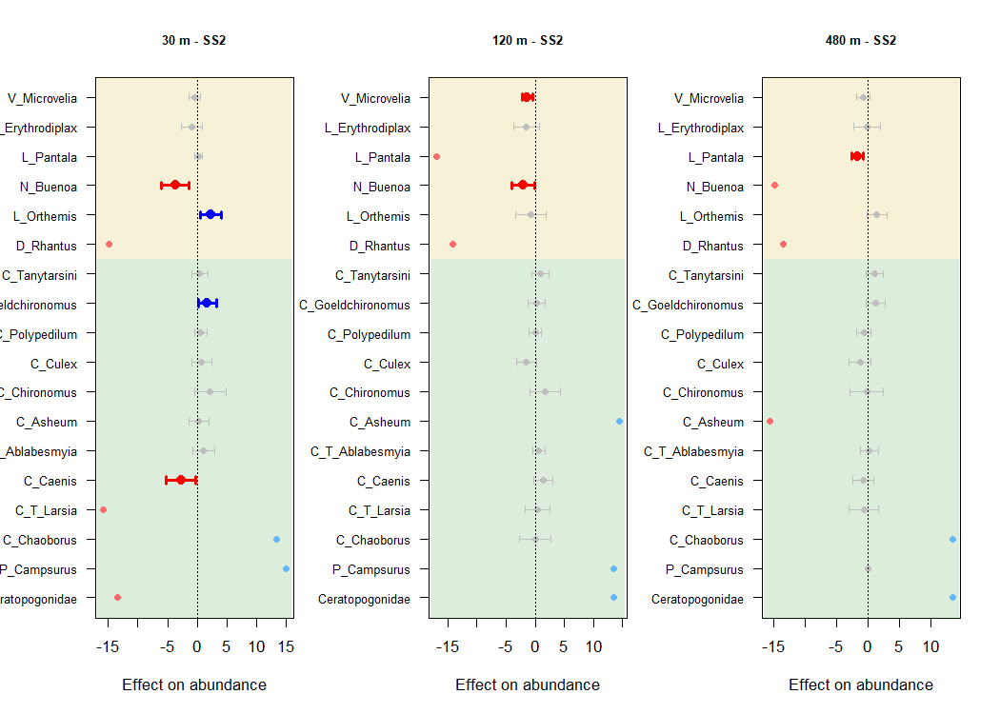
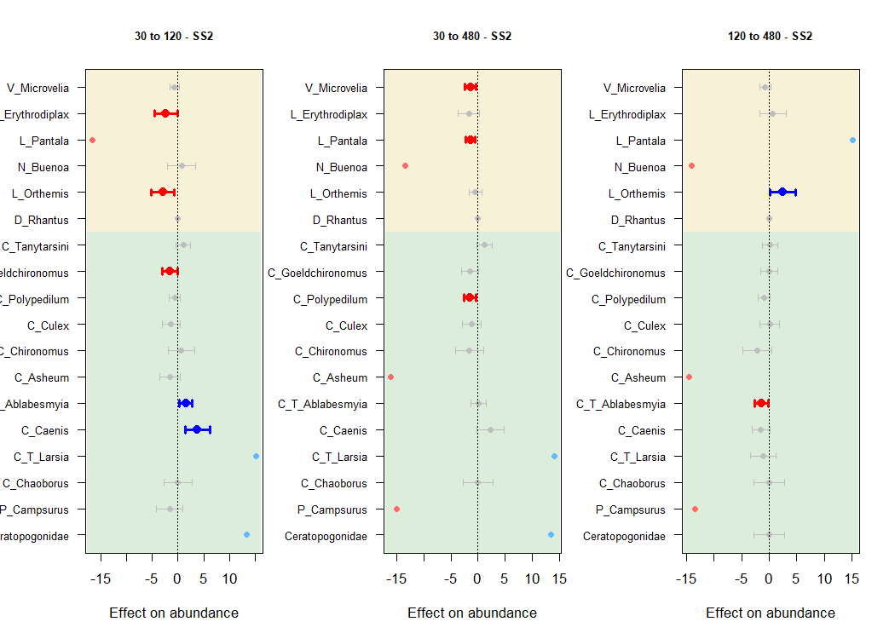
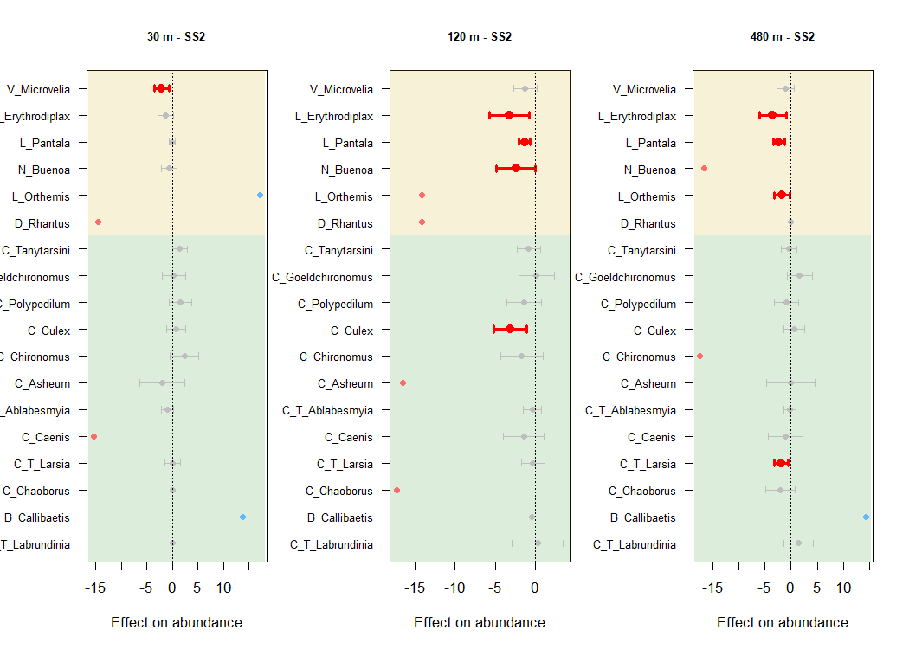

Community Structure
================
Rodolfo Pelinson
14/10/2020

The goal of PredatorIsolationComm is to walk the user through the
statistical analysis presented in:  
**“Pelinson et al 2020. Top predator introduction changes the effects of
spatial isolation on freshwater community structure”**  
DOI: <https://doi.org/10.1101/857318>

You can install the last version of `PredatorIsolationComm` package from
my [GitHub](https://github.com/RodolfoPelinson/PredatorIsolationComm)
with:

``` r
install.packages("devtools")
devtools::install_github("RodolfoPelinson/PredatorIsolationComm")
library("PredatorIsolationComm")
```

This will give you access to all the data and functions used to produce
the results shown in “Pelinson et al 2020. Top predator introduction
changes the effects of spatial isolation on freshwater community
structure”.

Other packages used here are:  
`vegan` version 2.5-6  
`mvabund` version 4.1.3  
`gllvm` version 1.2.2  
`permute` version 0.9-5

If you have problems with updated versions of those packages, you can
create a project with its own library. Then you update this library with
the packages used in this project at the versions that they were
originally used. To that, you can run this code:

``` r
install.packages("renv") #Only if do not have "renv"
renv::init()
renv::restore(lockfile = "https://raw.githubusercontent.com/RodolfoPelinson/PredatorIsolationComm/master/renv.lock",
              packages = c("vegan","permute","mvabund","gllvm","lme4","emmeans","adegraphics","adespatial","ade4","mvabund"),clean = FALSE)
```

It should update your library with the package versions used in this
project. This may take a while to create the library.

``` r
library(vegan)
library(permute)
library(mvabund)
library(gllvm)
```

## Testing for differences in community structure

Loading necessary data.

``` r
data(com,
     com_SS1, fish_SS1,isolation_SS1, TRAITS_SS1, 
     com_SS2, fish_SS2,isolation_SS2, TRAITS_SS2,
     com_SS3, fish_SS3,isolation_SS3, TRAITS_SS3)
```

When we considered all surveys together, we had to exclude ponds that
were missing in the third survey from the second and first surveys to
achieve a balanced design. The balanced design was necessary for our
permutation procedure, which accounted by the non-independence of ponds
sampled in different moments in time. The permutation procedure below
shuffles rows freely ponds freely within the same pond IDs, and then
pond IDs freely across treatments.

``` r
com_incomplete <- com[which(ID != "A4" & ID != "B3" & ID != "C3" & ID != "C4"),]
com_incomplete_oc <- decostand(com_incomplete, method = "pa")
com_incomplete <- com_incomplete[,which(colSums(com_incomplete_oc) > 3)]
isolation_incomplete <- isolation[which(ID != "A4" & ID != "B3" & ID != "C3" & ID != "C4")]
fish_incomplete <- fish[which(ID != "A4" & ID != "B3" & ID != "C3" & ID != "C4")]
survey_incomplete <- survey[which(ID != "A4" & ID != "B3" & ID != "C3" & ID != "C4")]
ID_incomplete <- ID[which(ID != "A4" & ID != "B3" & ID != "C3" & ID != "C4")]
ID_incomplete <- as.factor(as.character(ID_incomplete))


set.seed(3)
control <- permute::how(within = permute::Within(type = 'free'),
               plots = Plots(strata = ID_incomplete, type = 'free'),
               nperm = 10000)
permutations <- shuffleSet(nrow(com_incomplete), control = control)
```

Before running the models, we looked for the best probability
distribution to model our community data (abundance). We considered
Poisson and Negative Binomial distributions.

``` r
com_incomplete_mvabund <- mvabund(com_incomplete)

meanvar.plot(com_incomplete_mvabund, table =F, pch = 16) 
abline(a = 0, b = 1, lwd = 2)
box(lwd = 2)
```

<!-- -->

``` r
fit_incosistent_interaction_NB <- manyglm(com_incomplete_mvabund ~ survey_incomplete * (fish_incomplete * isolation_incomplete), family = "negative.binomial", cor.type = "I")
fit_incosistent_interaction_POIS <- manyglm(com_incomplete_mvabund ~ survey_incomplete * (fish_incomplete * isolation_incomplete), family = "poisson", cor.type = "I")

plot(fit_incosistent_interaction_POIS)
```

<!-- -->

``` r
plot(fit_incosistent_interaction_NB)
```

<!-- -->
We chose to use the Negative Binomial distribution to model data after
inspecting plots of variances against means and the spread of Dunn-Smyth
residuals against fitted values.

Now running the models and multivariate Likelihood Ratio Tests.

``` r
fit_no_effect <- manyglm(com_incomplete_mvabund ~ 1, family = "negative.binomial", cor.type = "I")
fit_Time <- manyglm(com_incomplete_mvabund ~ survey_incomplete, family = "negative.binomial", cor.type = "I")
fit_Time_fish <- manyglm(com_incomplete_mvabund ~ survey_incomplete + fish_incomplete, family = "negative.binomial", cor.type = "I")
fit_Time_fish_isolation <- manyglm(com_incomplete_mvabund ~ survey_incomplete + fish_incomplete + isolation_incomplete, family = "negative.binomial", cor.type = "I")
fit_Time_interaction <- manyglm(com_incomplete_mvabund ~ survey_incomplete + (fish_incomplete * isolation_incomplete), family = "negative.binomial", cor.type = "I")
fit_incosistent_interaction <- manyglm(com_incomplete_mvabund ~ survey_incomplete * (fish_incomplete * isolation_incomplete), family = "negative.binomial", cor.type = "I")


#Runing the Likelihood ratio tests
anova_incomplete <- anova(fit_no_effect,
                                  fit_Time,
                                  fit_Time_fish,
                                  fit_Time_fish_isolation,
                                  fit_Time_interaction,
                                  fit_incosistent_interaction, bootID = permutations ,  test = "LR", resamp = "pit.trap")
```

    ## Using <int> bootID matrix from input. 
    ## Time elapsed: 0 hr 28 min 36 sec

``` r
anova_incomplete
```

    ## Analysis of Deviance Table
    ## 
    ## fit_no_effect: com_incomplete_mvabund ~ 1
    ## fit_Time: com_incomplete_mvabund ~ survey_incomplete
    ## fit_Time_fish: com_incomplete_mvabund ~ survey_incomplete + fish_incomplete
    ## fit_Time_fish_isolation: com_incomplete_mvabund ~ survey_incomplete + fish_incomplete + isolation_incomplete
    ## fit_Time_interaction: com_incomplete_mvabund ~ survey_incomplete + (fish_incomplete * isolation_incomplete)
    ## fit_incosistent_interaction: com_incomplete_mvabund ~ survey_incomplete * (fish_incomplete * isolation_incomplete)
    ## 
    ## Multivariate test:
    ##                             Res.Df Df.diff   Dev Pr(>Dev)    
    ## fit_no_effect                   59                           
    ## fit_Time                        57       2 392.8   <2e-16 ***
    ## fit_Time_fish                   56       1  89.2   <2e-16 ***
    ## fit_Time_fish_isolation         54       2 109.2    0.001 ***
    ## fit_Time_interaction            52       2 120.3   <2e-16 ***
    ## fit_incosistent_interaction     42      10 210.6    0.036 *  
    ## ---
    ## Signif. codes:  0 '***' 0.001 '**' 0.01 '*' 0.05 '.' 0.1 ' ' 1
    ## Arguments:
    ##  Test statistics calculated assuming uncorrelated response (for faster computation) 
    ##  P-value calculated using 10000 iterations via PIT-trap resampling.

Because we had significant three way interactions, we choose to run
separete tests for each survey separetely.

First we have to change the abundance matrices into the right format fot
`mvabund` and also prepare other matrices that will be used.

``` r
com_SS1_mvabund <- mvabund(com_SS1)
com_SS2_mvabund <- mvabund(com_SS2)
com_SS3_mvabund <- mvabund(com_SS3)

env_SS1 <- data.frame(fish_SS1, isolation_SS1)
env_SS2 <- data.frame(fish_SS2, isolation_SS2)
env_SS3 <- data.frame(fish_SS3, isolation_SS3)

com_oc <- decostand(com, method = "pa")
```

### First Survey

``` r
fit_SS1_no_effect <- manyglm(com_SS1_mvabund ~  1, family = "negative.binomial")
fit_SS1_fish <- manyglm(com_SS1_mvabund ~  fish_SS1, family = "negative.binomial")
fit_SS1_isolation <- manyglm(com_SS1_mvabund ~  isolation_SS1, family = "negative.binomial")
fit_SS1_interaction <- manyglm(com_SS1_mvabund ~  fish_SS1*isolation_SS1, family = "negative.binomial")

set.seed(3);anova_SS1 <- anova(fit_SS1_interaction, nBoot = 10000,  p.uni  = "none", test = "LR")
```

    ## Time elapsed: 0 hr 2 min 26 sec

``` r
anova_SS1
```

    ## Analysis of Deviance Table
    ## 
    ## Model: com_SS1_mvabund ~ fish_SS1 * isolation_SS1
    ## 
    ## Multivariate test:
    ##                        Res.Df Df.diff   Dev Pr(>Dev)  
    ## (Intercept)                23                         
    ## fish_SS1                   22       1 19.01    0.106  
    ## isolation_SS1              20       2 24.38    0.398  
    ## fish_SS1:isolation_SS1     18       2 42.60    0.024 *
    ## ---
    ## Signif. codes:  0 '***' 0.001 '**' 0.01 '*' 0.05 '.' 0.1 ' ' 1
    ## Arguments:
    ##  Test statistics calculated assuming uncorrelated response (for faster computation) 
    ##  P-value calculated using 10000 iterations via PIT-trap resampling.

There is a significant interaction between isolation and presence of
fish.

Now, testing if the effect of treatments is mediated by trophic level:

``` r
env_SS1 <- data.frame(fish_SS1, isolation_SS1)

fit_SS1_no_trait_interaction <- traitglm(L = com_SS1, R = env_SS1, Q = TRAITS_SS1, formula = ~ isolation_SS1 * fish_SS1, method = "manyglm", col.intercepts = T)
fit_SS1_trait_pred_interaction <- traitglm(L = com_SS1, R = env_SS1, Q = TRAITS_SS1, formula = ~ (isolation_SS1:trophic) * (fish_SS1:trophic), method = "manyglm", col.intercepts = T)

set.seed(3);anova_SS1_trait_interaction <- anova.traitglm(fit_SS1_no_trait_interaction,
                                              fit_SS1_trait_pred_interaction,
                                              nBoot = 10000, test = "LR", show.time = "none")
anova_SS1_trait_interaction
```

    ## Analysis of Deviance Table
    ## 
    ## Model 1: ~isolation_SS1 * fish_SS1
    ## Model 2: ~(isolation_SS1:trophic) * (fish_SS1:trophic)
    ## 
    ## Multivariate test:
    ##         Res.Df Df.diff   Dev Pr(>Dev)  
    ## Model 1    202                         
    ## Model 2    197       5 19.26    0.096 .
    ## ---
    ## Signif. codes:  0 '***' 0.001 '**' 0.01 '*' 0.05 '.' 0.1 ' ' 1
    ## Arguments: P-value calculated using 10000 iterations via PIT-trap block resampling.

No, it is not\!

Plotting the ordination. We performed a model based unconstrained
ordination using function `gllvm` from package `gllvm` and the
`plot_ordination` function from this package.

``` r
fit_gllvm_no_effect_SS1<- gllvm(com_SS1,family = "negative.binomial", method = "VA", row.eff = F,n.init = 50, seed = 3, num.lv = 2)


colors_SS1 <- NULL
for (i in 1:dim(TRAITS_SS1)[1]){
  if(TRAITS_SS1$trophic[i] == "Pr"){colors_SS1[i] <- "gold3"}
  else {colors_SS1[i] <- "forestgreen"}
}

new_names_SS1 <- rownames(fit_gllvm_no_effect_SS1$params$theta)
for(i in 1:length(new_names_SS1)){ 
  if(substring(new_names_SS1, 4,4)[i] == "_"){
    new_names_SS1[i] <- substring(new_names_SS1[i], 5,7)
  }
  if(substring(new_names_SS1, 2,2)[i] == "_"){
    new_names_SS1[i] <- substring(new_names_SS1[i], 3,5)
  } else {new_names_SS1[i] <- substring(new_names_SS1[i], 1,3)}
}

plot_ordination(fit_gllvm_no_effect_SS1, x1 = fish_SS1, x2 = isolation_SS1,
                species = T, elipse = T, sites = T,
                site_colors = c("sienna1", "steelblue1","sienna3","steelblue3","sienna4", "steelblue4"),
                legend = T, legend_labels = c("Fishless - 30 m", "Fishless - 120 m","Fishless - 480 m","Fish - 30 m", "Fish - 120 m","Fish - 480 m"),
                legend_ncol = 2, legend_horiz = F,species_col = colors_SS1, species_names = new_names_SS1, main = "First Survey", species_size = TRAITS_SS1$volume_log, name_species_size = TRAITS_SS1$volume_log*0.21)
```

<!-- -->

Plotting pairwise comparisons coefficients and 95% confidence intervals
for each species. There is a lot of code (I hope to improve it in the
future\!) to get the actual coefficients and their respective intervals.
They are all in the file `coefs_for_plot.R`. We can call that file
through the `source` function. You may have to download the file
manually if you wish to run this code.

``` r
source("coefs_for_plots.R")
```

Now we can plot the coefficients using `My_coefplot` function from this
package.

First, we compare the effect of fish in each isolation distance.

``` r
ab_SS1_pred <- order(colSums(com[which(TRAITS$trophic == "Pr")])[which(colSums(com_oc[which(survey == "1"),which(TRAITS$trophic == "Pr")]) > 2)], decreasing = T)
ab_SS1_cons <- order(colSums(com[which(TRAITS$trophic == "Non_Pred")])[which(colSums(com_oc[which(survey == "1"),which(TRAITS$trophic == "Non_Pred")]) > 2)], decreasing = T)


par(mfrow = c(1,3), mar = c(5, 5, 4, 2) + 0.1)


My_coefplot(c(as.matrix(c(fish_effect_SS1_30[which(TRAITS_SS1$trophic == "Pr")][ab_SS1_pred],
                          fish_effect_SS1_30[which(TRAITS_SS1$trophic == "Non_Pred")][ab_SS1_cons]))),
            c(as.matrix(c(fish_effect_SS1_upper_30[which(TRAITS_SS1$trophic == "Pr")][ab_SS1_pred],
                          fish_effect_SS1_upper_30[which(TRAITS_SS1$trophic == "Non_Pred")][ab_SS1_cons]))),
            c(as.matrix(c(fish_effect_SS1_lower_30[which(TRAITS_SS1$trophic == "Pr")][ab_SS1_pred],
                          fish_effect_SS1_lower_30[which(TRAITS_SS1$trophic == "Non_Pred")][ab_SS1_cons]))),
            species_labels = c(names(fish_effect_SS1_30[which(TRAITS_SS1$trophic == "Pr")][ab_SS1_pred]),
                               names(fish_effect_SS1_30[which(TRAITS_SS1$trophic == "Non_Pred")][ab_SS1_cons])),
            xlab = "Effect on abundance",
            main = "30 m - SS1", cex.axis = 0.8, cex.main = 0.8, rect = T, rect_lim = 2)

My_coefplot(c(as.matrix(c(fish_effect_SS1_120[which(TRAITS_SS1$trophic == "Pr")][ab_SS1_pred],
                          fish_effect_SS1_120[which(TRAITS_SS1$trophic == "Non_Pred")][ab_SS1_cons]))),
            c(as.matrix(c(fish_effect_SS1_upper_120[which(TRAITS_SS1$trophic == "Pr")][ab_SS1_pred],
                          fish_effect_SS1_upper_120[which(TRAITS_SS1$trophic == "Non_Pred")][ab_SS1_cons]))),
            c(as.matrix(c(fish_effect_SS1_lower_120[which(TRAITS_SS1$trophic == "Pr")][ab_SS1_pred],
                          fish_effect_SS1_lower_120[which(TRAITS_SS1$trophic == "Non_Pred")][ab_SS1_cons]))),
            species_labels = c(names(fish_effect_SS1_120[which(TRAITS_SS1$trophic == "Pr")][ab_SS1_pred]),
                               names(fish_effect_SS1_120[which(TRAITS_SS1$trophic == "Non_Pred")][ab_SS1_cons])),
            xlab = "Effect on abundance",
            main = "120 m - SS1", cex.axis = 0.8, cex.main = 0.8, rect = T, rect_lim = 2)

My_coefplot(c(as.matrix(c(fish_effect_SS1_480[which(TRAITS_SS1$trophic == "Pr")][ab_SS1_pred],
                          fish_effect_SS1_480[which(TRAITS_SS1$trophic == "Non_Pred")][ab_SS1_cons]))),
            c(as.matrix(c(fish_effect_SS1_upper_480[which(TRAITS_SS1$trophic == "Pr")][ab_SS1_pred],
                          fish_effect_SS1_upper_480[which(TRAITS_SS1$trophic == "Non_Pred")][ab_SS1_cons]))),
            c(as.matrix(c(fish_effect_SS1_lower_480[which(TRAITS_SS1$trophic == "Pr")][ab_SS1_pred],
                          fish_effect_SS1_lower_480[which(TRAITS_SS1$trophic == "Non_Pred")][ab_SS1_cons]))),
            species_labels = c(names(fish_effect_SS1_480[which(TRAITS_SS1$trophic == "Pr")][ab_SS1_pred]),
                               names(fish_effect_SS1_480[which(TRAITS_SS1$trophic == "Non_Pred")][ab_SS1_cons])),
            xlab = "Effect on abundance",
            main = "480 m - SS1", cex.axis = 0.8, cex.main = 0.8, rect = T, rect_lim = 2)
```

<!-- -->

Now, the pairwise effect of isolation for ponds without fish.

``` r
par(mfrow = c(1,3), mar = c(5, 5, 4, 2) + 0.1)

My_coefplot(c(as.matrix(c(isolation_effect_SS1_30_120[which(TRAITS_SS1$trophic == "Pr")][ab_SS1_pred],
                          isolation_effect_SS1_30_120[which(TRAITS_SS1$trophic == "Non_Pred")][ab_SS1_cons]))),
            c(as.matrix(c(isolation_effect_SS1_upper_30_120[which(TRAITS_SS1$trophic == "Pr")][ab_SS1_pred],
                          isolation_effect_SS1_upper_30_120[which(TRAITS_SS1$trophic == "Non_Pred")][ab_SS1_cons]))),
            c(as.matrix(c(isolation_effect_SS1_lower_30_120[which(TRAITS_SS1$trophic == "Pr")][ab_SS1_pred],
                          isolation_effect_SS1_lower_30_120[which(TRAITS_SS1$trophic == "Non_Pred")][ab_SS1_cons]))),
            species_labels = c(names(isolation_effect_SS1_30_120[which(TRAITS_SS1$trophic == "Pr")][ab_SS1_pred]),
                               names(isolation_effect_SS1_30_120[which(TRAITS_SS1$trophic == "Non_Pred")][ab_SS1_cons])),
            xlab = "Effect on abundance",
            main = "30 to 120 - SS1", cex.axis = 0.8, cex.main = 0.8, rect = T, rect_lim = 2)


My_coefplot(c(as.matrix(c(isolation_effect_SS1_30_480[which(TRAITS_SS1$trophic == "Pr")][ab_SS1_pred],
                          isolation_effect_SS1_30_480[which(TRAITS_SS1$trophic == "Non_Pred")][ab_SS1_cons]))),
            c(as.matrix(c(isolation_effect_SS1_upper_30_480[which(TRAITS_SS1$trophic == "Pr")][ab_SS1_pred],
                          isolation_effect_SS1_upper_30_480[which(TRAITS_SS1$trophic == "Non_Pred")][ab_SS1_cons]))),
            c(as.matrix(c(isolation_effect_SS1_lower_30_480[which(TRAITS_SS1$trophic == "Pr")][ab_SS1_pred],
                          isolation_effect_SS1_lower_30_480[which(TRAITS_SS1$trophic == "Non_Pred")][ab_SS1_cons]))),
            species_labels = c(names(isolation_effect_SS1_30_480[which(TRAITS_SS1$trophic == "Pr")][ab_SS1_pred]),
                               names(isolation_effect_SS1_30_480[which(TRAITS_SS1$trophic == "Non_Pred")][ab_SS1_cons])),
            xlab = "Effect on abundance",
            main = "30 to 480 - SS1", cex.axis = 0.8, cex.main = 0.8, rect = T, rect_lim = 2)


My_coefplot(c(as.matrix(c(isolation_effect_SS1_120_480[which(TRAITS_SS1$trophic == "Pr")][ab_SS1_pred],
                          isolation_effect_SS1_120_480[which(TRAITS_SS1$trophic == "Non_Pred")][ab_SS1_cons]))),
            c(as.matrix(c(isolation_effect_SS1_upper_120_480[which(TRAITS_SS1$trophic == "Pr")][ab_SS1_pred],
                          isolation_effect_SS1_upper_120_480[which(TRAITS_SS1$trophic == "Non_Pred")][ab_SS1_cons]))),
            c(as.matrix(c(isolation_effect_SS1_lower_120_480[which(TRAITS_SS1$trophic == "Pr")][ab_SS1_pred],
                          isolation_effect_SS1_lower_120_480[which(TRAITS_SS1$trophic == "Non_Pred")][ab_SS1_cons]))),
            species_labels = c(names(isolation_effect_SS1_120_480[which(TRAITS_SS1$trophic == "Pr")][ab_SS1_pred]),
                               names(isolation_effect_SS1_120_480[which(TRAITS_SS1$trophic == "Non_Pred")][ab_SS1_cons])),
            xlab = "Effect on abundance",
            main = "120 to 480 - SS1", cex.axis = 0.8, cex.main = 0.8, rect = T, rect_lim = 2)
```

<!-- -->

And, the pairwise effect of isolation for ponds with fish.

``` r
par(mfrow = c(1,3), mar = c(5, 5, 4, 2) + 0.1)

My_coefplot(c(as.matrix(c(isolation_effect_fish_SS1_30_120[which(TRAITS_SS1$trophic == "Pr")][ab_SS1_pred],
                          isolation_effect_fish_SS1_30_120[which(TRAITS_SS1$trophic == "Non_Pred")][ab_SS1_cons]))),
            c(as.matrix(c(isolation_effect_fish_SS1_upper_30_120[which(TRAITS_SS1$trophic == "Pr")][ab_SS1_pred],
                          isolation_effect_fish_SS1_upper_30_120[which(TRAITS_SS1$trophic == "Non_Pred")][ab_SS1_cons]))),
            c(as.matrix(c(isolation_effect_fish_SS1_lower_30_120[which(TRAITS_SS1$trophic == "Pr")][ab_SS1_pred],
                          isolation_effect_fish_SS1_lower_30_120[which(TRAITS_SS1$trophic == "Non_Pred")][ab_SS1_cons]))),
            species_labels = c(names(isolation_effect_fish_SS1_30_120[which(TRAITS_SS1$trophic == "Pr")][ab_SS1_pred]),
                               names(isolation_effect_fish_SS1_30_120[which(TRAITS_SS1$trophic == "Non_Pred")][ab_SS1_cons])),
            xlab = "Effect on abundance",
            main = "30 to 120 - SS1", cex.axis = 0.8, cex.main = 0.8, rect = T, rect_lim = 2)


My_coefplot(c(as.matrix(c(isolation_effect_fish_SS1_30_480[which(TRAITS_SS1$trophic == "Pr")][ab_SS1_pred],
                          isolation_effect_fish_SS1_30_480[which(TRAITS_SS1$trophic == "Non_Pred")][ab_SS1_cons]))),
            c(as.matrix(c(isolation_effect_fish_SS1_upper_30_480[which(TRAITS_SS1$trophic == "Pr")][ab_SS1_pred],
                          isolation_effect_fish_SS1_upper_30_480[which(TRAITS_SS1$trophic == "Non_Pred")][ab_SS1_cons]))),
            c(as.matrix(c(isolation_effect_fish_SS1_lower_30_480[which(TRAITS_SS1$trophic == "Pr")][ab_SS1_pred],
                          isolation_effect_fish_SS1_lower_30_480[which(TRAITS_SS1$trophic == "Non_Pred")][ab_SS1_cons]))),
            species_labels = c(names(isolation_effect_fish_SS1_30_480[which(TRAITS_SS1$trophic == "Pr")][ab_SS1_pred]),
                               names(isolation_effect_fish_SS1_30_480[which(TRAITS_SS1$trophic == "Non_Pred")][ab_SS1_cons])),
            xlab = "Effect on abundance",
            main = "30 to 480 - SS1", cex.axis = 0.8, cex.main = 0.8, rect = T, rect_lim = 2)


My_coefplot(c(as.matrix(c(isolation_effect_fish_SS1_120_480[which(TRAITS_SS1$trophic == "Pr")][ab_SS1_pred],
                          isolation_effect_fish_SS1_120_480[which(TRAITS_SS1$trophic == "Non_Pred")][ab_SS1_cons]))),
            c(as.matrix(c(isolation_effect_fish_SS1_upper_120_480[which(TRAITS_SS1$trophic == "Pr")][ab_SS1_pred],
                          isolation_effect_fish_SS1_upper_120_480[which(TRAITS_SS1$trophic == "Non_Pred")][ab_SS1_cons]))),
            c(as.matrix(c(isolation_effect_fish_SS1_lower_120_480[which(TRAITS_SS1$trophic == "Pr")][ab_SS1_pred],
                          isolation_effect_fish_SS1_lower_120_480[which(TRAITS_SS1$trophic == "Non_Pred")][ab_SS1_cons]))),
            species_labels = c(names(isolation_effect_fish_SS1_120_480[which(TRAITS_SS1$trophic == "Pr")][ab_SS1_pred]),
                               names(isolation_effect_fish_SS1_120_480[which(TRAITS_SS1$trophic == "Non_Pred")][ab_SS1_cons])),
            xlab = "Effect on abundance",
            main = "120 to 480 - SS1", cex.axis = 0.8, cex.main = 0.8, rect = T, rect_lim = 2)
```

<!-- -->

### Second Survey

``` r
fit_SS2_no_effect <- manyglm(com_SS2_mvabund ~  1, family = "negative.binomial")
fit_SS2_fish <- manyglm(com_SS2_mvabund ~  fish_SS2, family = "negative.binomial")
fit_SS2_fish_isolation <- manyglm(com_SS2_mvabund ~  fish_SS2+isolation_SS2, family = "negative.binomial")
fit_SS2_interaction <- manyglm(com_SS2_mvabund ~  fish_SS2*isolation_SS2, family = "negative.binomial")


set.seed(3);anova_SS2 <- anova(fit_SS2_interaction, nBoot = 10000,  p.uni  = "none", test = "LR")
```

    ## Time elapsed: 0 hr 5 min 16 sec

``` r
anova_SS2
```

    ## Analysis of Deviance Table
    ## 
    ## Model: com_SS2_mvabund ~ fish_SS2 * isolation_SS2
    ## 
    ## Multivariate test:
    ##                        Res.Df Df.diff   Dev Pr(>Dev)    
    ## (Intercept)                23                           
    ## fish_SS2                   22       1 62.28    0.001 ***
    ## isolation_SS2              20       2 71.81    0.025 *  
    ## fish_SS2:isolation_SS2     18       2 72.15    0.016 *  
    ## ---
    ## Signif. codes:  0 '***' 0.001 '**' 0.01 '*' 0.05 '.' 0.1 ' ' 1
    ## Arguments:
    ##  Test statistics calculated assuming uncorrelated response (for faster computation) 
    ##  P-value calculated using 10000 iterations via PIT-trap resampling.

Again, we see a significant interaction between isolation and presence
of fish.

Now, testing if the effect of treatments is mediated by trophic level:

``` r
fit_SS2_no_trait_interaction <- traitglm(L = com_SS2, R = env_SS2, Q = TRAITS_SS2, formula = ~ isolation_SS2 * fish_SS2, method = "manyglm", col.intercepts = T)
fit_SS2_trait_pred_interaction <- traitglm(L = com_SS2, R = env_SS2, Q = TRAITS_SS2, formula = ~ (isolation_SS2:trophic) * (fish_SS2:trophic), method = "manyglm", col.intercepts = T)

set.seed(3);anova_SS2_trait_interaction <- anova.traitglm(fit_SS2_no_trait_interaction,
                                              fit_SS2_trait_pred_interaction,
                                              nBoot = 10000, test = "LR", show.time = "none")
anova_SS2_trait_interaction
```

    ## Analysis of Deviance Table
    ## 
    ## Model 1: ~isolation_SS2 * fish_SS2
    ## Model 2: ~(isolation_SS2:trophic) * (fish_SS2:trophic)
    ## 
    ## Multivariate test:
    ##         Res.Df Df.diff   Dev Pr(>Dev)   
    ## Model 1    409                          
    ## Model 2    404       5 33.74    0.002 **
    ## ---
    ## Signif. codes:  0 '***' 0.001 '**' 0.01 '*' 0.05 '.' 0.1 ' ' 1
    ## Arguments: P-value calculated using 10000 iterations via PIT-trap block resampling.

Yes, it is\!

Plotting the ordination.

``` r
fit_gllvm_no_effect_SS2<- gllvm(com_SS2,family = "negative.binomial", method = "VA", row.eff = F,n.init = 50, seed = 3, num.lv = 2)

colors_SS2 <- NULL
for (i in 1:dim(TRAITS_SS2)[1]){
  if(TRAITS_SS2$trophic[i] == "Pr"){colors_SS2[i] <- "gold3"}
  else {colors_SS2[i] <- "forestgreen"}
}

new_names_SS2 <- rownames(fit_gllvm_no_effect_SS2$params$theta)
for(i in 1:length(new_names_SS2)){ 
  if(substring(new_names_SS2, 4,4)[i] == "_"){
    new_names_SS2[i] <- substring(new_names_SS2[i], 5,7)
  }
  if(substring(new_names_SS2, 2,2)[i] == "_"){
    new_names_SS2[i] <- substring(new_names_SS2[i], 3,5)
  } else {new_names_SS2[i] <- substring(new_names_SS2[i], 1,3)}
}

plot_ordination(fit_gllvm_no_effect_SS2, x1 = fish_SS2, x2 = isolation_SS2,
                species = T, elipse = T, sites = T,
                site_colors = c("sienna1", "steelblue1","sienna3","steelblue3","sienna4", "steelblue4"),
                legend = F, legend_labels = c("Fishless - 30 m", "Fishless - 120 m","Fishless - 480 m","Fish - 30 m", "Fish - 120 m","Fish - 480 m"),
                legend_ncol = 2, legend_horiz = F,species_col = colors_SS2, species_names = new_names_SS2, main = "Second Survey", species_size = TRAITS_SS2$volume_log, name_species_size =  TRAITS_SS2$volume_log*0.21)
```

<!-- -->

Plotting coefficients and confidence intervals for each species.

First, we compare the effect of fish in each isolation distance.

``` r
ab_SS2_pred <- order(colSums(com[which(TRAITS$trophic == "Pr")])[which(colSums(com_oc[which(survey == "1"),which(TRAITS$trophic == "Pr")]) > 2)], decreasing = T)
ab_SS2_cons <- order(colSums(com[which(TRAITS$trophic == "Non_Pred")])[which(colSums(com_oc[which(survey == "1"),which(TRAITS$trophic == "Non_Pred")]) > 2)], decreasing = T)

par(mfrow = c(1,3), mar = c(5, 5, 4, 2) + 0.1)

My_coefplot(c(as.matrix(c(fish_effect_SS2_30[which(TRAITS_SS2$trophic == "Pr")][ab_SS2_pred],
                          fish_effect_SS2_30[which(TRAITS_SS2$trophic == "Non_Pred")][ab_SS2_cons]))),
            c(as.matrix(c(fish_effect_SS2_upper_30[which(TRAITS_SS2$trophic == "Pr")][ab_SS2_pred],
                          fish_effect_SS2_upper_30[which(TRAITS_SS2$trophic == "Non_Pred")][ab_SS2_cons]))),
            c(as.matrix(c(fish_effect_SS2_lower_30[which(TRAITS_SS2$trophic == "Pr")][ab_SS2_pred],
                          fish_effect_SS2_lower_30[which(TRAITS_SS2$trophic == "Non_Pred")][ab_SS2_cons]))),
            species_labels = c(names(fish_effect_SS2_30[which(TRAITS_SS2$trophic == "Pr")][ab_SS2_pred]),
                               names(fish_effect_SS2_30[which(TRAITS_SS2$trophic == "Non_Pred")][ab_SS2_cons])),
            xlab = "Effect on abundance",
            main = "30 m - SS2", cex.axis = 0.8, cex.main = 0.8, rect = T, rect_lim = 6)

My_coefplot(c(as.matrix(c(fish_effect_SS2_120[which(TRAITS_SS2$trophic == "Pr")][ab_SS2_pred],
                          fish_effect_SS2_120[which(TRAITS_SS2$trophic == "Non_Pred")][ab_SS2_cons]))),
            c(as.matrix(c(fish_effect_SS2_upper_120[which(TRAITS_SS2$trophic == "Pr")][ab_SS2_pred],
                          fish_effect_SS2_upper_120[which(TRAITS_SS2$trophic == "Non_Pred")][ab_SS2_cons]))),
            c(as.matrix(c(fish_effect_SS2_lower_120[which(TRAITS_SS2$trophic == "Pr")][ab_SS2_pred],
                          fish_effect_SS2_lower_120[which(TRAITS_SS2$trophic == "Non_Pred")][ab_SS2_cons]))),
            species_labels = c(names(fish_effect_SS2_120[which(TRAITS_SS2$trophic == "Pr")][ab_SS2_pred]),
                               names(fish_effect_SS2_120[which(TRAITS_SS2$trophic == "Non_Pred")][ab_SS2_cons])),
            xlab = "Effect on abundance",
            main = "120 m - SS2", cex.axis = 0.8, cex.main = 0.8, rect = T, rect_lim = 6)

My_coefplot(c(as.matrix(c(fish_effect_SS2_480[which(TRAITS_SS2$trophic == "Pr")][ab_SS2_pred],
                          fish_effect_SS2_480[which(TRAITS_SS2$trophic == "Non_Pred")][ab_SS2_cons]))),
            c(as.matrix(c(fish_effect_SS2_upper_480[which(TRAITS_SS2$trophic == "Pr")][ab_SS2_pred],
                          fish_effect_SS2_upper_480[which(TRAITS_SS2$trophic == "Non_Pred")][ab_SS2_cons]))),
            c(as.matrix(c(fish_effect_SS2_lower_480[which(TRAITS_SS2$trophic == "Pr")][ab_SS2_pred],
                          fish_effect_SS2_lower_480[which(TRAITS_SS2$trophic == "Non_Pred")][ab_SS2_cons]))),
            species_labels = c(names(fish_effect_SS2_480[which(TRAITS_SS2$trophic == "Pr")][ab_SS2_pred]),
                               names(fish_effect_SS2_480[which(TRAITS_SS2$trophic == "Non_Pred")][ab_SS2_cons])),
            xlab = "Effect on abundance",
            main = "480 m - SS2", cex.axis = 0.8, cex.main = 0.8, rect = T, rect_lim = 6)
```

<!-- -->

Because the effect of treatments on aquatic insects was mediated by
trophic level, we can assess the same parameters for predators and
non-predators as a whole.

``` r
par(mfrow = c(1,3), mar = c(5, 5, 4, 2) + 0.1)

My_coefplot(c(as.matrix(rev(trait_fish_30_SS2))),
            c(as.matrix(rev(trait_fish_30_SS2_upper))),
            c(as.matrix(rev(trait_fish_30_SS2_lower))),
            species_labels = c("Predators", "Non-Predators"),
            xlab = NULL,
            main = "30 m - SS2", cex.axis = 0.8, cex.main = 0.8,y_spa = 0.25, rect = T, rect_lim = 1)

My_coefplot(c(as.matrix(rev(trait_fish_120_SS2))),
            c(as.matrix(rev(trait_fish_120_SS2_upper))),
            c(as.matrix(rev(trait_fish_120_SS2_lower))),
            species_labels = c("Predators", "Non-Predators"),
            xlab = NULL,
            main = "120 m - SS2", cex.axis = 0.8, cex.main = 0.8,y_spa = 0.25, rect = T, rect_lim = 1)

My_coefplot(c(as.matrix(rev(trait_fish_480_SS2))),
            c(as.matrix(rev(trait_fish_480_SS2_upper))),
            c(as.matrix(rev(trait_fish_480_SS2_lower))),
            species_labels = c("Predators", "Non-Predators"),
            xlab = NULL,
            main = "480 m - SS2", cex.axis = 0.8, cex.main = 0.8,y_spa = 0.25, rect = T, rect_lim = 1)
```

<!-- -->

Now, the pairwise effect of isolation for ponds without fish for each
species.

``` r
par(mfrow = c(1,3), mar = c(5, 5, 4, 2) + 0.1)

My_coefplot(c(as.matrix(c(isolation_effect_SS2_30_120[which(TRAITS_SS2$trophic == "Pr")][ab_SS2_pred],
                          isolation_effect_SS2_30_120[which(TRAITS_SS2$trophic == "Non_Pred")][ab_SS2_cons]))),
            c(as.matrix(c(isolation_effect_SS2_upper_30_120[which(TRAITS_SS2$trophic == "Pr")][ab_SS2_pred],
                          isolation_effect_SS2_upper_30_120[which(TRAITS_SS2$trophic == "Non_Pred")][ab_SS2_cons]))),
            c(as.matrix(c(isolation_effect_SS2_lower_30_120[which(TRAITS_SS2$trophic == "Pr")][ab_SS2_pred],
                          isolation_effect_SS2_lower_30_120[which(TRAITS_SS2$trophic == "Non_Pred")][ab_SS2_cons]))),
            species_labels = c(names(isolation_effect_SS2_30_120[which(TRAITS_SS2$trophic == "Pr")][ab_SS2_pred]),
                               names(isolation_effect_SS2_30_120[which(TRAITS_SS2$trophic == "Non_Pred")][ab_SS2_cons])),
            xlab = "Effect on abundance",
            main = "30 to 120 - SS2", cex.axis = 0.8, cex.main = 0.8, rect = T, rect_lim = 6)


My_coefplot(c(as.matrix(c(isolation_effect_SS2_30_480[which(TRAITS_SS2$trophic == "Pr")][ab_SS2_pred],
                          isolation_effect_SS2_30_480[which(TRAITS_SS2$trophic == "Non_Pred")][ab_SS2_cons]))),
            c(as.matrix(c(isolation_effect_SS2_upper_30_480[which(TRAITS_SS2$trophic == "Pr")][ab_SS2_pred],
                          isolation_effect_SS2_upper_30_480[which(TRAITS_SS2$trophic == "Non_Pred")][ab_SS2_cons]))),
            c(as.matrix(c(isolation_effect_SS2_lower_30_480[which(TRAITS_SS2$trophic == "Pr")][ab_SS2_pred],
                          isolation_effect_SS2_lower_30_480[which(TRAITS_SS2$trophic == "Non_Pred")][ab_SS2_cons]))),
            species_labels = c(names(isolation_effect_SS2_30_480[which(TRAITS_SS2$trophic == "Pr")][ab_SS2_pred]),
                               names(isolation_effect_SS2_30_480[which(TRAITS_SS2$trophic == "Non_Pred")][ab_SS2_cons])),
            xlab = "Effect on abundance",
            main = "30 to 480 - SS2", cex.axis = 0.8, cex.main = 0.8, rect = T, rect_lim = 6)


My_coefplot(c(as.matrix(c(isolation_effect_SS2_120_480[which(TRAITS_SS2$trophic == "Pr")][ab_SS2_pred],
                          isolation_effect_SS2_120_480[which(TRAITS_SS2$trophic == "Non_Pred")][ab_SS2_cons]))),
            c(as.matrix(c(isolation_effect_SS2_upper_120_480[which(TRAITS_SS2$trophic == "Pr")][ab_SS2_pred],
                          isolation_effect_SS2_upper_120_480[which(TRAITS_SS2$trophic == "Non_Pred")][ab_SS2_cons]))),
            c(as.matrix(c(isolation_effect_SS2_lower_120_480[which(TRAITS_SS2$trophic == "Pr")][ab_SS2_pred],
                          isolation_effect_SS2_lower_120_480[which(TRAITS_SS2$trophic == "Non_Pred")][ab_SS2_cons]))),
            species_labels = c(names(isolation_effect_SS2_120_480[which(TRAITS_SS2$trophic == "Pr")][ab_SS2_pred]),
                               names(isolation_effect_SS2_120_480[which(TRAITS_SS2$trophic == "Non_Pred")][ab_SS2_cons])),
            xlab = "Effect on abundance",
            main = "120 to 480 - SS2", cex.axis = 0.8, cex.main = 0.8, rect = T, rect_lim = 6)
```

<!-- -->

For trophic level.

``` r
par(mfrow = c(1,3), mar = c(5, 5, 4, 2) + 0.1)

My_coefplot(c(as.matrix(rev(trait_30_120_SS2))),
            c(as.matrix(rev(trait_30_120_SS2_upper))),
            c(as.matrix(rev(trait_30_120_SS2_lower))),
            species_labels = c("Predators", "Non Predators"),
            xlab = NULL,
            main = "30 m to 120 m - SS2", cex.axis = 0.8, cex.main = 0.8,y_spa = 0.25, rect = T, rect_lim = 1)

My_coefplot(c(as.matrix(rev(trait_30_480_SS2))),
            c(as.matrix(rev(trait_30_480_SS2_upper))),
            c(as.matrix(rev(trait_30_480_SS2_lower))),
            species_labels = c("Predators", "Non Predators"),
            xlab = NULL,
            main = "30 m to 480 m- SS2", cex.axis = 0.8, cex.main = 0.8,y_spa = 0.25, rect = T, rect_lim = 1)

My_coefplot(c(as.matrix(rev(trait_120_480_SS2))),
            c(as.matrix(rev(trait_120_480_SS2_upper))),
            c(as.matrix(rev(trait_120_480_SS2_lower))),
            species_labels = c("Predators", "Non Predators"),
            xlab = NULL,
            main = "120 m to 480 m - SS2", cex.axis = 0.8, cex.main = 0.8,y_spa = 0.25, rect = T, rect_lim = 1)
```

<!-- -->

And, the pairwise effect of isolation for ponds with fish for each
species.

``` r
par(mfrow = c(1,3), mar = c(5, 5, 4, 2) + 0.1)

My_coefplot(c(as.matrix(c(isolation_effect_fish_SS2_30_120[which(TRAITS_SS2$trophic == "Pr")][ab_SS2_pred],
                          isolation_effect_fish_SS2_30_120[which(TRAITS_SS2$trophic == "Non_Pred")][ab_SS2_cons]))),
            c(as.matrix(c(isolation_effect_fish_SS2_upper_30_120[which(TRAITS_SS2$trophic == "Pr")][ab_SS2_pred],
                          isolation_effect_fish_SS2_upper_30_120[which(TRAITS_SS2$trophic == "Non_Pred")][ab_SS2_cons]))),
            c(as.matrix(c(isolation_effect_fish_SS2_lower_30_120[which(TRAITS_SS2$trophic == "Pr")][ab_SS2_pred],
                          isolation_effect_fish_SS2_lower_30_120[which(TRAITS_SS2$trophic == "Non_Pred")][ab_SS2_cons]))),
            species_labels = c(names(isolation_effect_fish_SS2_30_120[which(TRAITS_SS2$trophic == "Pr")][ab_SS2_pred]),
                               names(isolation_effect_fish_SS2_30_120[which(TRAITS_SS2$trophic == "Non_Pred")][ab_SS2_cons])),
            xlab = "Effect on abundance",
            main = "30 to 120 - SS2", cex.axis = 0.8, cex.main = 0.8, rect = T, rect_lim = 6)


My_coefplot(c(as.matrix(c(isolation_effect_fish_SS2_30_480[which(TRAITS_SS2$trophic == "Pr")][ab_SS2_pred],
                          isolation_effect_fish_SS2_30_480[which(TRAITS_SS2$trophic == "Non_Pred")][ab_SS2_cons]))),
            c(as.matrix(c(isolation_effect_fish_SS2_upper_30_480[which(TRAITS_SS2$trophic == "Pr")][ab_SS2_pred],
                          isolation_effect_fish_SS2_upper_30_480[which(TRAITS_SS2$trophic == "Non_Pred")][ab_SS2_cons]))),
            c(as.matrix(c(isolation_effect_fish_SS2_lower_30_480[which(TRAITS_SS2$trophic == "Pr")][ab_SS2_pred],
                          isolation_effect_fish_SS2_lower_30_480[which(TRAITS_SS2$trophic == "Non_Pred")][ab_SS2_cons]))),
            species_labels = c(names(isolation_effect_fish_SS2_30_480[which(TRAITS_SS2$trophic == "Pr")][ab_SS2_pred]),
                               names(isolation_effect_fish_SS2_30_480[which(TRAITS_SS2$trophic == "Non_Pred")][ab_SS2_cons])),
            xlab = "Effect on abundance",
            main = "30 to 480 - SS2", cex.axis = 0.8, cex.main = 0.8, rect = T, rect_lim = 6)


My_coefplot(c(as.matrix(c(isolation_effect_fish_SS2_120_480[which(TRAITS_SS2$trophic == "Pr")][ab_SS2_pred],
                          isolation_effect_fish_SS2_120_480[which(TRAITS_SS2$trophic == "Non_Pred")][ab_SS2_cons]))),
            c(as.matrix(c(isolation_effect_fish_SS2_upper_120_480[which(TRAITS_SS2$trophic == "Pr")][ab_SS2_pred],
                          isolation_effect_fish_SS2_upper_120_480[which(TRAITS_SS2$trophic == "Non_Pred")][ab_SS2_cons]))),
            c(as.matrix(c(isolation_effect_fish_SS2_lower_120_480[which(TRAITS_SS2$trophic == "Pr")][ab_SS2_pred],
                          isolation_effect_fish_SS2_lower_120_480[which(TRAITS_SS2$trophic == "Non_Pred")][ab_SS2_cons]))),
            species_labels = c(names(isolation_effect_fish_SS2_120_480[which(TRAITS_SS2$trophic == "Pr")][ab_SS2_pred]),
                               names(isolation_effect_fish_SS2_120_480[which(TRAITS_SS2$trophic == "Non_Pred")][ab_SS2_cons])),
            xlab = "Effect on abundance",
            main = "120 to 480 - SS2", cex.axis = 0.8, cex.main = 0.8, rect = T, rect_lim = 6)
```

<!-- -->

For trophic level.

``` r
par(mfrow = c(1,3), mar = c(5, 5, 4, 2) + 0.1)

My_coefplot(c(as.matrix(rev(trait_30_120_fish_SS2))),
            c(as.matrix(rev(trait_30_120_fish_SS2_upper))),
            c(as.matrix(rev(trait_30_120_fish_SS2_lower))),
            species_labels = c("Predators", "Non Predators"),
            xlab = NULL,
            main = "30 m to 120 m - SS2 - FISH", cex.axis = 0.8, cex.main = 0.8,y_spa = 0.25, rect = T, rect_lim = 1)

My_coefplot(c(as.matrix(rev(trait_30_480_fish_SS2))),
            c(as.matrix(rev(trait_30_480_fish_SS2_upper))),
            c(as.matrix(rev(trait_30_480_fish_SS2_lower))),
            species_labels = c("Predators", "Non Predators"),
            xlab = NULL,
            main = "30 m to 480 m- SS2 - FISH", cex.axis = 0.8, cex.main = 0.8,y_spa = 0.25, rect = T, rect_lim = 1)

My_coefplot(c(as.matrix(rev(trait_120_480_fish_SS2))),
            c(as.matrix(rev(trait_120_480_fish_SS2_upper))),
            c(as.matrix(rev(trait_120_480_fish_SS2_lower))),
            species_labels = c("Predators", "Non Predators"),
            xlab = NULL,
            main = "120 m to 480 m - SS2 - FISH", cex.axis = 0.8, cex.main = 0.8,y_spa = 0.25, rect = T, rect_lim = 1)
```

<!-- -->

### Third Survey

``` r
fit_SS3_no_effect <- manyglm(com_SS3_mvabund ~  1, family = "negative.binomial")
fit_SS3_fish <- manyglm(com_SS3_mvabund ~  fish_SS3, family = "negative.binomial")
fit_SS3_fish_isolation <- manyglm(com_SS3_mvabund ~  fish_SS3+isolation_SS3, family = "negative.binomial")
fit_SS3_interaction <- manyglm(com_SS3_mvabund ~  fish_SS3*isolation_SS3, family = "negative.binomial")


set.seed(3);anova_SS3 <- anova(fit_SS3_interaction, nBoot = 10000,  p.uni  = "none", test = "LR")
```

    ## Time elapsed: 0 hr 4 min 57 sec

``` r
anova_SS3
```

    ## Analysis of Deviance Table
    ## 
    ## Model: com_SS3_mvabund ~ fish_SS3 * isolation_SS3
    ## 
    ## Multivariate test:
    ##                        Res.Df Df.diff   Dev Pr(>Dev)  
    ## (Intercept)                19                         
    ## fish_SS3                   18       1 49.09    0.018 *
    ## isolation_SS3              16       2 72.96    0.055 .
    ## fish_SS3:isolation_SS3     14       2 91.12    0.015 *
    ## ---
    ## Signif. codes:  0 '***' 0.001 '**' 0.01 '*' 0.05 '.' 0.1 ' ' 1
    ## Arguments:
    ##  Test statistics calculated assuming uncorrelated response (for faster computation) 
    ##  P-value calculated using 10000 iterations via PIT-trap resampling.

Again, we see a significant interaction between isolation and presence
of fish.

Now, testing if the effect of treatments is mediated by trophic level:

``` r
fit_SS3_no_trait_interaction <- traitglm(L = com_SS3, R = env_SS3, formula = ~ isolation_SS3 * fish_SS3, method = "manyglm", col.intercepts = T)
```

    ## No traits matrix entered, so will fit SDMs with different env response for each spp

``` r
fit_SS3_trait_pred_interaction <- traitglm(L = com_SS3, R = env_SS3, Q = TRAITS_SS3, formula = ~ (isolation_SS3:trophic) * (fish_SS3:trophic), method = "manyglm", col.intercepts = T)

set.seed(3);anova_SS3_trait_interaction <- anova(fit_SS3_no_trait_interaction,
                                              fit_SS3_trait_pred_interaction,
                                              nBoot = 10000, test = "LR", show.time = "none")
anova_SS3_trait_interaction
```

    ## Analysis of Deviance Table
    ## 
    ## Model 1: ~isolation_SS3 * fish_SS3
    ## Model 2: ~(isolation_SS3:trophic) * (fish_SS3:trophic)
    ## 
    ## Multivariate test:
    ##         Res.Df Df.diff   Dev Pr(>Dev)  
    ## Model 1    337                         
    ## Model 2    332       5 33.71    0.032 *
    ## ---
    ## Signif. codes:  0 '***' 0.001 '**' 0.01 '*' 0.05 '.' 0.1 ' ' 1
    ## Arguments: P-value calculated using 10000 iterations via PIT-trap block resampling.

Yes\! it is\!

Plotting the ordination.

``` r
fit_gllvm_no_effect_SS3<- gllvm(com_SS3,family = "negative.binomial", method = "VA", row.eff = F,n.init = 50, seed = 3, num.lv = 2)

colors_SS3 <- NULL
for (i in 1:dim(TRAITS_SS3)[1]){
  if(TRAITS_SS3$trophic[i] == "Pr"){colors_SS3[i] <- "gold3"}
  else {colors_SS3[i] <- "forestgreen"}
}

new_names_SS3 <- rownames(fit_gllvm_no_effect_SS3$params$theta)
for(i in 1:length(new_names_SS3)){ 
  if(substring(new_names_SS3, 4,4)[i] == "_"){
    new_names_SS3[i] <- substring(new_names_SS3[i], 5,7)
  }
  if(substring(new_names_SS3, 2,2)[i] == "_"){
    new_names_SS3[i] <- substring(new_names_SS3[i], 3,5)
  } else {new_names_SS3[i] <- substring(new_names_SS3[i], 1,3)}
}

plot_ordination(fit_gllvm_no_effect_SS3, x1 = fish_SS3, x2 = isolation_SS3,
                species = T, elipse = T, sites = T,
                site_colors = c("sienna1", "steelblue1","sienna3","steelblue3","sienna4", "steelblue4"),
                legend = F, legend_labels = c("Fishless - 30 m", "Fishless - 120 m","Fishless - 480 m","Fish - 30 m", "Fish - 120 m","Fish - 480 m"),
                legend_ncol = 2, legend_horiz = F,species_col = colors_SS3, species_names = new_names_SS3, main = "Third Survey", species_size = TRAITS_SS3$volume_log, name_species_size =  TRAITS_SS3$volume_log*0.21, plot_centroid_dist = TRUE)
```

<!-- -->

Plotting coefficients and confidence intervals for each species.

First, we compare the effect of fish in each isolation distance.

``` r
ab_SS3_pred <- order(colSums(com[which(TRAITS$trophic == "Pr")])[which(colSums(com_oc[which(survey == "1"),which(TRAITS$trophic == "Pr")]) > 2)], decreasing = T)
ab_SS3_cons <- order(colSums(com[which(TRAITS$trophic == "Non_Pred")])[which(colSums(com_oc[which(survey == "1"),which(TRAITS$trophic == "Non_Pred")]) > 2)], decreasing = T)

par(mfrow = c(1,3), mar = c(5, 5, 4, 2) + 0.1)

My_coefplot(c(as.matrix(c(fish_effect_SS3_30[which(TRAITS_SS3$trophic == "Pr")][ab_SS3_pred],
                          fish_effect_SS3_30[which(TRAITS_SS3$trophic == "Non_Pred")][ab_SS3_cons]))),
            c(as.matrix(c(fish_effect_SS3_upper_30[which(TRAITS_SS3$trophic == "Pr")][ab_SS3_pred],
                          fish_effect_SS3_upper_30[which(TRAITS_SS3$trophic == "Non_Pred")][ab_SS3_cons]))),
            c(as.matrix(c(fish_effect_SS3_lower_30[which(TRAITS_SS3$trophic == "Pr")][ab_SS3_pred],
                          fish_effect_SS3_lower_30[which(TRAITS_SS3$trophic == "Non_Pred")][ab_SS3_cons]))),
            species_labels = c(names(fish_effect_SS3_30[which(TRAITS_SS3$trophic == "Pr")][ab_SS3_pred]),
                               names(fish_effect_SS3_30[which(TRAITS_SS3$trophic == "Non_Pred")][ab_SS3_cons])),
            xlab = "Effect on abundance",
            main = "30 m - SS2", cex.axis = 0.8, cex.main = 0.8, rect = T, rect_lim = 6)

My_coefplot(c(as.matrix(c(fish_effect_SS3_120[which(TRAITS_SS3$trophic == "Pr")][ab_SS3_pred],
                          fish_effect_SS3_120[which(TRAITS_SS3$trophic == "Non_Pred")][ab_SS3_cons]))),
            c(as.matrix(c(fish_effect_SS3_upper_120[which(TRAITS_SS3$trophic == "Pr")][ab_SS3_pred],
                          fish_effect_SS3_upper_120[which(TRAITS_SS3$trophic == "Non_Pred")][ab_SS3_cons]))),
            c(as.matrix(c(fish_effect_SS3_lower_120[which(TRAITS_SS3$trophic == "Pr")][ab_SS3_pred],
                          fish_effect_SS3_lower_120[which(TRAITS_SS3$trophic == "Non_Pred")][ab_SS3_cons]))),
            species_labels = c(names(fish_effect_SS3_120[which(TRAITS_SS3$trophic == "Pr")][ab_SS3_pred]),
                               names(fish_effect_SS3_120[which(TRAITS_SS3$trophic == "Non_Pred")][ab_SS3_cons])),
            xlab = "Effect on abundance",
            main = "120 m - SS2", cex.axis = 0.8, cex.main = 0.8, rect = T, rect_lim = 6)

My_coefplot(c(as.matrix(c(fish_effect_SS3_480[which(TRAITS_SS3$trophic == "Pr")][ab_SS3_pred],
                          fish_effect_SS3_480[which(TRAITS_SS3$trophic == "Non_Pred")][ab_SS3_cons]))),
            c(as.matrix(c(fish_effect_SS3_upper_480[which(TRAITS_SS3$trophic == "Pr")][ab_SS3_pred],
                          fish_effect_SS3_upper_480[which(TRAITS_SS3$trophic == "Non_Pred")][ab_SS3_cons]))),
            c(as.matrix(c(fish_effect_SS3_lower_480[which(TRAITS_SS3$trophic == "Pr")][ab_SS3_pred],
                          fish_effect_SS3_lower_480[which(TRAITS_SS3$trophic == "Non_Pred")][ab_SS3_cons]))),
            species_labels = c(names(fish_effect_SS3_480[which(TRAITS_SS3$trophic == "Pr")][ab_SS3_pred]),
                               names(fish_effect_SS3_480[which(TRAITS_SS3$trophic == "Non_Pred")][ab_SS3_cons])),
            xlab = "Effect on abundance",
            main = "480 m - SS2", cex.axis = 0.8, cex.main = 0.8, rect = T, rect_lim = 6)
```

<!-- -->

Because the effect of treatments on aquatic insects was mediated by
trophic level, we can assess the same parameters for predators and
non-predators as a whole.

``` r
par(mfrow = c(1,3), mar = c(5, 5, 4, 2) + 0.1)

My_coefplot(c(as.matrix(rev(trait_fish_30_SS3))),
            c(as.matrix(rev(trait_fish_30_SS3_upper))),
            c(as.matrix(rev(trait_fish_30_SS3_lower))),
            species_labels = c("Predators", "Non Predators"),
            xlab = NULL,
            main = "30 m - SS2", cex.axis = 0.8, cex.main = 0.8,y_spa = 0.25, rect = T, rect_lim = 1)

My_coefplot(c(as.matrix(rev(trait_fish_120_SS3))),
            c(as.matrix(rev(trait_fish_120_SS3_upper))),
            c(as.matrix(rev(trait_fish_120_SS3_lower))),
            species_labels = c("Predators", "Non Predators"),
            xlab = NULL,
            main = "30 m - SS2", cex.axis = 0.8, cex.main = 0.8,y_spa = 0.25, rect = T, rect_lim = 1)

My_coefplot(c(as.matrix(rev(trait_fish_480_SS3))),
            c(as.matrix(rev(trait_fish_480_SS3_upper))),
            c(as.matrix(rev(trait_fish_480_SS3_lower))),
            species_labels = c("Predators", "Non Predators"),
            xlab = NULL,
            main = "30 m - SS2", cex.axis = 0.8, cex.main = 0.8,y_spa = 0.25, rect = T, rect_lim = 1)
```

<!-- -->

Now, the pairwise effect of isolation for ponds without fish for each
species.

``` r
par(mfrow = c(1,3), mar = c(5, 5, 4, 2) + 0.1)

My_coefplot(c(as.matrix(c(isolation_effect_SS3_30_120[which(TRAITS_SS3$trophic == "Pr")][ab_SS3_pred],
                          isolation_effect_SS3_30_120[which(TRAITS_SS3$trophic == "Non_Pred")][ab_SS3_cons]))),
            c(as.matrix(c(isolation_effect_SS3_upper_30_120[which(TRAITS_SS3$trophic == "Pr")][ab_SS3_pred],
                          isolation_effect_SS3_upper_30_120[which(TRAITS_SS3$trophic == "Non_Pred")][ab_SS3_cons]))),
            c(as.matrix(c(isolation_effect_SS3_lower_30_120[which(TRAITS_SS3$trophic == "Pr")][ab_SS3_pred],
                          isolation_effect_SS3_lower_30_120[which(TRAITS_SS3$trophic == "Non_Pred")][ab_SS3_cons]))),
            species_labels = c(names(isolation_effect_SS3_30_120[which(TRAITS_SS3$trophic == "Pr")][ab_SS3_pred]),
                               names(isolation_effect_SS3_30_120[which(TRAITS_SS3$trophic == "Non_Pred")][ab_SS3_cons])),
            xlab = "Effect on abundance",
            main = "30 to 120 - SS2", cex.axis = 0.8, cex.main = 0.8, rect = T, rect_lim = 6)


My_coefplot(c(as.matrix(c(isolation_effect_SS3_30_480[which(TRAITS_SS3$trophic == "Pr")][ab_SS3_pred],
                          isolation_effect_SS3_30_480[which(TRAITS_SS3$trophic == "Non_Pred")][ab_SS3_cons]))),
            c(as.matrix(c(isolation_effect_SS3_upper_30_480[which(TRAITS_SS3$trophic == "Pr")][ab_SS3_pred],
                          isolation_effect_SS3_upper_30_480[which(TRAITS_SS3$trophic == "Non_Pred")][ab_SS3_cons]))),
            c(as.matrix(c(isolation_effect_SS3_lower_30_480[which(TRAITS_SS3$trophic == "Pr")][ab_SS3_pred],
                          isolation_effect_SS3_lower_30_480[which(TRAITS_SS3$trophic == "Non_Pred")][ab_SS3_cons]))),
            species_labels = c(names(isolation_effect_SS3_30_480[which(TRAITS_SS3$trophic == "Pr")][ab_SS3_pred]),
                               names(isolation_effect_SS3_30_480[which(TRAITS_SS3$trophic == "Non_Pred")][ab_SS3_cons])),
            xlab = "Effect on abundance",
            main = "30 to 480 - SS2", cex.axis = 0.8, cex.main = 0.8, rect = T, rect_lim = 6)


My_coefplot(c(as.matrix(c(isolation_effect_SS3_120_480[which(TRAITS_SS3$trophic == "Pr")][ab_SS3_pred],
                          isolation_effect_SS3_120_480[which(TRAITS_SS3$trophic == "Non_Pred")][ab_SS3_cons]))),
            c(as.matrix(c(isolation_effect_SS3_upper_120_480[which(TRAITS_SS3$trophic == "Pr")][ab_SS3_pred],
                          isolation_effect_SS3_upper_120_480[which(TRAITS_SS3$trophic == "Non_Pred")][ab_SS3_cons]))),
            c(as.matrix(c(isolation_effect_SS3_lower_120_480[which(TRAITS_SS3$trophic == "Pr")][ab_SS3_pred],
                          isolation_effect_SS3_lower_120_480[which(TRAITS_SS3$trophic == "Non_Pred")][ab_SS3_cons]))),
            species_labels = c(names(isolation_effect_SS3_120_480[which(TRAITS_SS3$trophic == "Pr")][ab_SS3_pred]),
                               names(isolation_effect_SS3_120_480[which(TRAITS_SS3$trophic == "Non_Pred")][ab_SS3_cons])),
            xlab = "Effect on abundance",
            main = "120 to 480 - SS2", cex.axis = 0.8, cex.main = 0.8, rect = T, rect_lim = 6)
```

<!-- -->

For trophic level.

``` r
par(mfrow = c(1,3), mar = c(5, 5, 4, 2) + 0.1)

My_coefplot(c(as.matrix(rev(trait_30_120_SS3))),
            c(as.matrix(rev(trait_30_120_SS3_upper))),
            c(as.matrix(rev(trait_30_120_SS3_lower))),
            species_labels = c("Predators", "Non Predators"),
            xlab = NULL,
            main = "30 m to 120 m - SS3", cex.axis = 0.8, cex.main = 0.8, y_spa = 0.25, rect = T, rect_lim = 1)

My_coefplot(c(as.matrix(rev(trait_30_480_SS3))),
            c(as.matrix(rev(trait_30_480_SS3_upper))),
            c(as.matrix(rev(trait_30_480_SS3_lower))),
            species_labels = c("Predators", "Non Predators"),
            xlab = NULL,
            main = "30 m to 480 m- SS3", cex.axis = 0.8, cex.main = 0.8, y_spa = 0.25, rect = T, rect_lim = 1)

My_coefplot(c(as.matrix(rev(trait_120_480_SS3))),
            c(as.matrix(rev(trait_120_480_SS3_upper))),
            c(as.matrix(rev(trait_120_480_SS3_lower))),
            species_labels = c("Predators", "Non Predators"),
            xlab = NULL,
            main = "120 m to 480 m - SS3", cex.axis = 0.8, cex.main = 0.8, y_spa = 0.25, rect = T, rect_lim = 1)
```

<!-- -->

And, the pairwise effect of isolation for ponds with fish for each
species.

``` r
par(mfrow = c(1,3), mar = c(5, 5, 4, 2) + 0.1)

My_coefplot(c(as.matrix(c(isolation_effect_fish_SS3_30_120[which(TRAITS_SS3$trophic == "Pr")][ab_SS3_pred],
                          isolation_effect_fish_SS3_30_120[which(TRAITS_SS3$trophic == "Non_Pred")][ab_SS3_cons]))),
            c(as.matrix(c(isolation_effect_fish_SS3_upper_30_120[which(TRAITS_SS3$trophic == "Pr")][ab_SS3_pred],
                          isolation_effect_fish_SS3_upper_30_120[which(TRAITS_SS3$trophic == "Non_Pred")][ab_SS3_cons]))),
            c(as.matrix(c(isolation_effect_fish_SS3_lower_30_120[which(TRAITS_SS3$trophic == "Pr")][ab_SS3_pred],
                          isolation_effect_fish_SS3_lower_30_120[which(TRAITS_SS3$trophic == "Non_Pred")][ab_SS3_cons]))),
            species_labels = c(names(isolation_effect_fish_SS3_30_120[which(TRAITS_SS3$trophic == "Pr")][ab_SS3_pred]),
                               names(isolation_effect_fish_SS3_30_120[which(TRAITS_SS3$trophic == "Non_Pred")][ab_SS3_cons])),
            xlab = "Effect on abundance",
            main = "30 to 120 - SS3", cex.axis = 0.8, cex.main = 0.8, rect = T, rect_lim = 6)


My_coefplot(c(as.matrix(c(isolation_effect_fish_SS3_30_480[which(TRAITS_SS3$trophic == "Pr")][ab_SS3_pred],
                          isolation_effect_fish_SS3_30_480[which(TRAITS_SS3$trophic == "Non_Pred")][ab_SS3_cons]))),
            c(as.matrix(c(isolation_effect_fish_SS3_upper_30_480[which(TRAITS_SS3$trophic == "Pr")][ab_SS3_pred],
                          isolation_effect_fish_SS3_upper_30_480[which(TRAITS_SS3$trophic == "Non_Pred")][ab_SS3_cons]))),
            c(as.matrix(c(isolation_effect_fish_SS3_lower_30_480[which(TRAITS_SS3$trophic == "Pr")][ab_SS3_pred],
                          isolation_effect_fish_SS3_lower_30_480[which(TRAITS_SS3$trophic == "Non_Pred")][ab_SS3_cons]))),
            species_labels = c(names(isolation_effect_fish_SS3_30_480[which(TRAITS_SS3$trophic == "Pr")][ab_SS3_pred]),
                               names(isolation_effect_fish_SS3_30_480[which(TRAITS_SS3$trophic == "Non_Pred")][ab_SS3_cons])),
            xlab = "Effect on abundance",
            main = "30 to 480 - SS3", cex.axis = 0.8, cex.main = 0.8, rect = T, rect_lim = 6)


My_coefplot(c(as.matrix(c(isolation_effect_fish_SS3_120_480[which(TRAITS_SS3$trophic == "Pr")][ab_SS3_pred],
                          isolation_effect_fish_SS3_120_480[which(TRAITS_SS3$trophic == "Non_Pred")][ab_SS3_cons]))),
            c(as.matrix(c(isolation_effect_fish_SS3_upper_120_480[which(TRAITS_SS3$trophic == "Pr")][ab_SS3_pred],
                          isolation_effect_fish_SS3_upper_120_480[which(TRAITS_SS3$trophic == "Non_Pred")][ab_SS3_cons]))),
            c(as.matrix(c(isolation_effect_fish_SS3_lower_120_480[which(TRAITS_SS3$trophic == "Pr")][ab_SS3_pred],
                          isolation_effect_fish_SS3_lower_120_480[which(TRAITS_SS3$trophic == "Non_Pred")][ab_SS3_cons]))),
            species_labels = c(names(isolation_effect_fish_SS3_120_480[which(TRAITS_SS3$trophic == "Pr")][ab_SS3_pred]),
                               names(isolation_effect_fish_SS3_120_480[which(TRAITS_SS3$trophic == "Non_Pred")][ab_SS3_cons])),
            xlab = "Effect on abundance",
            main = "120 to 480 - SS3", cex.axis = 0.8, cex.main = 0.8, rect = T, rect_lim = 6)
```

<!-- -->

For trophic level.

``` r
par(mfrow = c(1,3), mar = c(5, 5, 4, 2) + 0.1)

My_coefplot(c(as.matrix(rev(trait_30_120_fish_SS3))),
            c(as.matrix(rev(trait_30_120_fish_SS3_upper))),
            c(as.matrix(rev(trait_30_120_fish_SS3_lower))),
            species_labels = c("Predators", "Non Predators"),
            xlab = NULL,
            main = "30 m to 120 m - SS3 - FISH", cex.axis = 0.8, cex.main = 0.8, y_spa = 0.25, rect = T, rect_lim = 1)

My_coefplot(c(as.matrix(rev(trait_30_480_fish_SS3))),
            c(as.matrix(rev(trait_30_480_fish_SS3_upper))),
            c(as.matrix(rev(trait_30_480_fish_SS3_lower))),
            species_labels = c("Predators", "Non Predators"),
            xlab = NULL,
            main = "30 m to 480 m- SS3 - FISH", cex.axis = 0.8, cex.main = 0.8, y_spa = 0.25, rect = T, rect_lim = 1)

My_coefplot(c(as.matrix(rev(trait_120_480_fish_SS3))),
            c(as.matrix(rev(trait_120_480_fish_SS3_upper))),
            c(as.matrix(rev(trait_120_480_fish_SS3_lower))),
            species_labels = c("Predators", "Non Predators"),
            xlab = NULL,
            main = "120 m to 480 m - SS3 - FISH", cex.axis = 0.8, cex.main = 0.8, y_spa = 0.25, rect = T, rect_lim = 1)
```

<!-- -->

## Testing for differences in distances of centroids of fish and fishless treatments in different isolation treatments.

Here we will use a the function `Dif_dist()` to compute the distances
between the centroids of fish and fishless treatments in each isolation
treatment from the unconstrained ordination done by the `gllvm` function
from package `gllvm`. Then, we compute the differences among the
distances between the different distances and assess significance by
permuting rows of the matrix always within fish and fishless treatments.
By doing that we keep the mean differences among ponds with and without
fish, but randomize any differences in the effect of fish across the
isolation gradient.

### First Survey

``` r
#Excluding samples for balanced design
set.seed(3)
Dif_dist_SS1<- Dif_dist(com = com_SS1, x1 = fish_SS1, x2 = isolation_SS1, nperm = 10000, family = "negative.binomial", num.lv = 2, strata = T, show.perm = F, orig_n.init = 20, perm_n.init = 1, type = "centroid", method = "VA", refit_perm = F)
```

    ## Starting 20 initial runs of the original GLLVM fit

    ## Original GLLVM fit finished

    ## Starting Permutations

    ## FINISHED

``` r
Dif_dist_SS1$distances
```

    ##         30m     120m      480m
    ## 1 0.6891425 1.099904 0.7301238

``` r
Dif_dist_SS1$diferences
```

    ##   30 -> 120 120 -> 480  30 -> 480
    ## 1 0.4107614 -0.3697801 0.04098132

``` r
Dif_dist_SS1$p.values
```

    ##                            30 -> 120 120 -> 480 30 -> 480
    ## Greater                      0.26350    0.71510    0.4769
    ## Greater (Adjusted - FDR)     0.71510    0.71510    0.7151
    ## Lower                        0.73650    0.28490    0.5231
    ## Lower (Adjusted - FDR)       0.73650    0.73650    0.7365
    ## Two sided                    0.51960    0.56350    0.9501
    ## Two sided (Adjusted - FDR)   0.84525    0.84525    0.9501

### Second Survey

``` r
#Excluding samples for balanced design
set.seed(3)
Dif_dist_SS2<- Dif_dist(com = com_SS2, x1 = fish_SS2, x2 = isolation_SS1, nperm = 10000, family = "negative.binomial", num.lv = 2, strata = T, show.perm = F, orig_n.init = 20, perm_n.init = 1, type = "centroid", method = "VA", refit_perm = F)
```

    ## Starting 20 initial runs of the original GLLVM fit

    ## Original GLLVM fit finished

    ## Starting Permutations

    ## FINISHED

``` r
Dif_dist_SS2$distances
```

    ##        30m    120m     480m
    ## 1 1.327957 1.60427 1.331215

``` r
Dif_dist_SS2$diferences
```

    ##   30 -> 120 120 -> 480   30 -> 480
    ## 1  0.276313 -0.2730546 0.003258477

``` r
Dif_dist_SS2$p.values
```

    ##                            30 -> 120 120 -> 480 30 -> 480
    ## Greater                       0.3278     0.6820    0.4908
    ## Greater (Adjusted - FDR)      0.6820     0.6820    0.6820
    ## Lower                         0.6722     0.3180    0.5092
    ## Lower (Adjusted - FDR)        0.6722     0.6722    0.6722
    ## Two sided                     0.6528     0.6562    0.9948
    ## Two sided (Adjusted - FDR)    0.9843     0.9843    0.9948

### Third Survey

Here, again we had to exclude two ponds from the 30 and 120 isolation
treatments to achieve a balanced design. We randomly selected one
fishless pond from the 30m and 120m isolation treatments to be excluded.

``` r
#Excluding samples for balanced design
set.seed(1)
first <- sample(row(com_SS3)[which(fish_SS3=="absent" & isolation_SS3 == "30")], size = 1)
second <- sample(row(com_SS3)[which(fish_SS3=="absent" & isolation_SS3 == "120")], size = 1)
com_SS3_incomplete <- com_SS3[-c(first,second),]
fish_SS3_incomplete <- fish_SS3[-c(first,second)]
isolation_SS3_incomplete <- isolation_SS3[-c(first,second)]

set.seed(1)
Dif_dist_SS3<- Dif_dist(com = com_SS3_incomplete, x1 = fish_SS3_incomplete,x2 = isolation_SS3_incomplete,nperm = 10000, family = "negative.binomial", num.lv = 2,
                                    strata = T, show.perm = F, orig_n.init = 20, perm_n.init = 1, type = "centroid", method = "VA", refit_perm = F)
```

    ## Starting 20 initial runs of the original GLLVM fit

    ## Original GLLVM fit finished

    ## Starting Permutations

    ## FINISHED

``` r
Dif_dist_SS3$distances
```

    ##         30m     120m     480m
    ## 1 0.5228584 1.774739 2.151831

``` r
Dif_dist_SS3$diferences
```

    ##   30 -> 120 120 -> 480 30 -> 480
    ## 1  1.251881  0.3770919  1.628973

``` r
Dif_dist_SS3$p.values
```

    ##                            30 -> 120 120 -> 480 30 -> 480
    ## Greater                      0.03650     0.3039    0.0058
    ## Greater (Adjusted - FDR)     0.05475     0.3039    0.0174
    ## Lower                        0.96350     0.6961    0.9942
    ## Lower (Adjusted - FDR)       0.99420     0.9942    0.9942
    ## Two sided                    0.07060     0.5954    0.0108
    ## Two sided (Adjusted - FDR)   0.10590     0.5954    0.0324

We can check if our permutation procedure is working by using the
`plot_null` function to plot some of the null communities generated by
`Dif_dist()`. This is an example of the first 15 permutations for the
third survey:

``` r
set.seed(3)
par(mfrow = c(4,4))
plot_null(com_SS3_incomplete, nperm = 15 ,x1 = fish_SS3_incomplete, x2 = isolation_SS3_incomplete,
          family = "negative.binomial", strata = T, orig_n.init = 10, xlim = c(-2.5,2.5), ylim = c(-2.5,2.5), 
          refit_perm = F, elipse = T, site_colors = c("sienna1", "steelblue1","sienna3","steelblue3","sienna4", "steelblue4"))
```

    ## [1] "Starting 10 initial runs of the original GLLVM fit"
    ## [1] "Original GLLVM fit finished"

<!-- --> It
seems like everything is ok.
