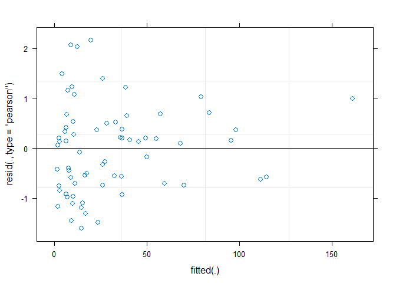
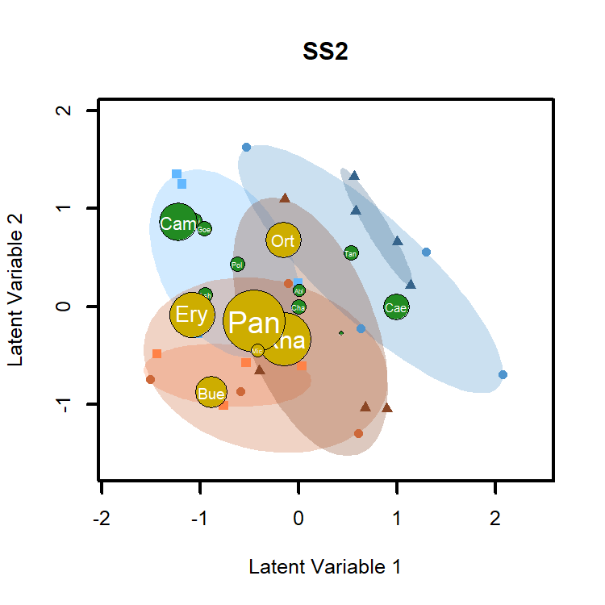
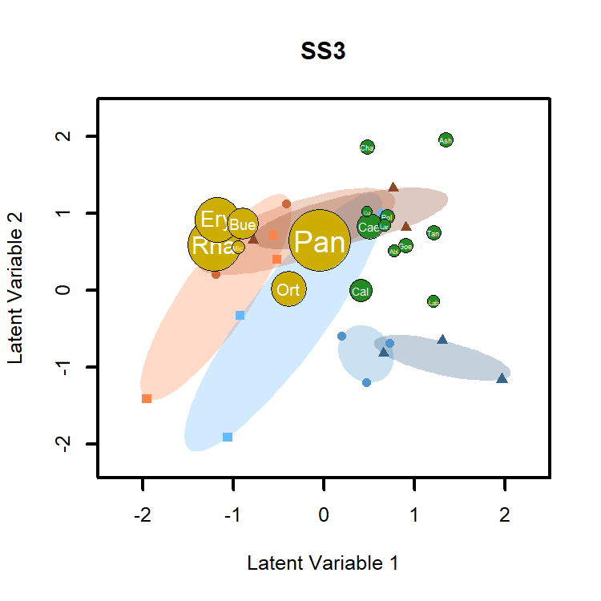
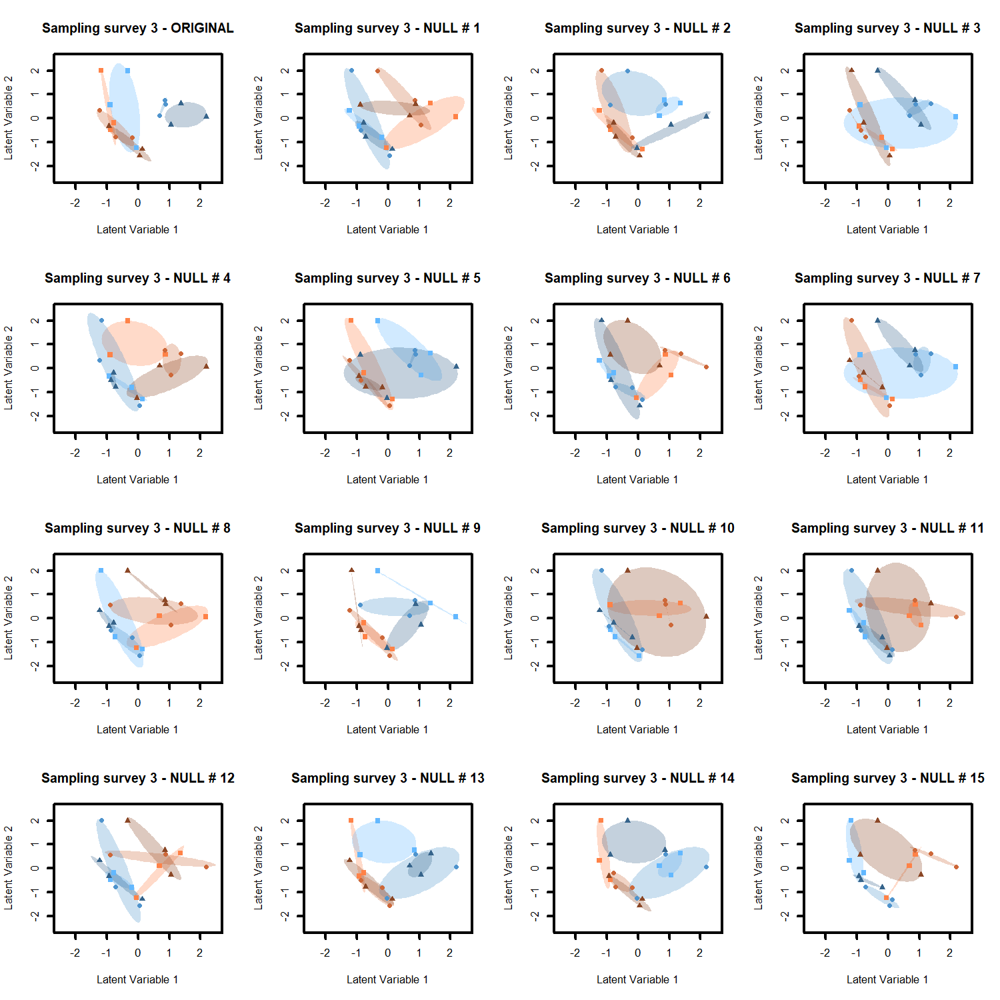

<!-- README.md is generated from README.Rmd. Please edit that file -->

# pelinson.et.al.2020

<!-- badges: start -->

<!-- badges: end -->

The goal of pelinson.et.al.2020 is to walk the user through the
statistical analysis presented in “Pelinson et al 2020. Top predator
introduction changes the effects of spatial isolation on freshwater
community structure”

## Installation

You can install the last version of `pelinson.et.al.2020` package from
my [GitHub](https://github.com/RodolfoPelinson/pelinson.et.al.2020)
with:

``` r
#install.packages("devtools")
#devtools::install_github("RodolfoPelinson/pelinson.et.al.2020")
library(pelinson.et.al.2020)
```

Other packages used here are: `vegan` version 2.5-6  
`lme4` version 1.1-23  
`emmeans` version 1.4.8  
`mvabund` version 4.1.3  
`gllvm` version 1.2.2  
`permute` version 0.9-5

``` r
library(vegan)
library(permute)
library(mvabund)
library(gllvm)
library(lme4)
```

This will give you access to all the data and functions used to produce
the results shown in “Pelinson et al 2020. Top predator introduction
changes the effects of spatial isolation on freshwater community
structure”.

## Testing for differences in abundance

First, lets load the necessary data.

``` r
data(abundance_predators)
data(abundance_consumers)
data(survey)
data(fish)
data(isolation)
data(ID)
```

This is for testing for differences in the abundance of predatory
insects across all treatments and sampling surveys. We used generalized
linear mixed models with a negative binomial distribution (`glmer.nb`
function from package `lme4`) to fit the models. Then we used `anova`
from package `lme4` to compute likelihood ratio tests.

``` r
`pred_no_effect` <- glmer.nb(abundance_predators~ 1 + (1|ID), data = treatments, control = glmerControl(optimizer = "bobyqa"))
`pred_survey` <- glmer.nb(abundance_predators~(survey) + (1|ID), data = treatments, control = glmerControl(optimizer = "bobyqa"))
`pred_fish` <- glmer.nb(abundance_predators~(survey+fish) + (1|ID), data = treatments, control = glmerControl(optimizer = "bobyqa"))
`pred_isolation` <- glmer.nb(abundance_predators~(survey+fish+isolation) + (1|ID), data = treatments, control = glmerControl(optimizer = "bobyqa"))
`pred_survey:fish` <- glmer.nb(abundance_predators~(survey + fish + isolation + survey:fish) + (1|ID), data = treatments, control = glmerControl(optimizer = "bobyqa"))
`pred_survey:isolation` <- glmer.nb(abundance_predators~(survey + fish + isolation + survey:fish + survey:isolation) + (1|ID), data = treatments, control = glmerControl(optimizer = "bobyqa"))
`pred_fish:isolation` <- glmer.nb(abundance_predators~(survey + fish + isolation + survey:fish + survey:isolation + fish:isolation) + (1|ID), data = treatments, control = glmerControl(optimizer = "bobyqa"))
`pred_survey:fish:isolation` <- glmer.nb(abundance_predators~(survey + fish + isolation + survey:fish + survey:isolation + fish:isolation + survey:fish:isolation) + (1|ID), data = treatments, control = glmerControl(optimizer = "bobyqa"))

Anova_predators <- anova(`pred_no_effect`, 
      `pred_survey`,
      `pred_fish`,
      `pred_isolation`,
      `pred_survey:fish`,
      `pred_survey:isolation`,
      `pred_fish:isolation`,
      `pred_survey:fish:isolation`)

Anova_predators
#> Data: treatments
#> Models:
#> pred_no_effect: abundance_predators ~ 1 + (1 | ID)
#> pred_survey: abundance_predators ~ (survey) + (1 | ID)
#> pred_fish: abundance_predators ~ (survey + fish) + (1 | ID)
#> pred_isolation: abundance_predators ~ (survey + fish + isolation) + (1 | ID)
#> pred_survey:fish: abundance_predators ~ (survey + fish + isolation + survey:fish) + 
#> pred_survey:fish:     (1 | ID)
#> pred_survey:isolation: abundance_predators ~ (survey + fish + isolation + survey:fish + 
#> pred_survey:isolation:     survey:isolation) + (1 | ID)
#> pred_fish:isolation: abundance_predators ~ (survey + fish + isolation + survey:fish + 
#> pred_fish:isolation:     survey:isolation + fish:isolation) + (1 | ID)
#> pred_survey:fish:isolation: abundance_predators ~ (survey + fish + isolation + survey:fish + 
#> pred_survey:fish:isolation:     survey:isolation + fish:isolation + survey:fish:isolation) + 
#> pred_survey:fish:isolation:     (1 | ID)
#>                            npar    AIC    BIC  logLik deviance   Chisq Df
#> pred_no_effect                3 607.28 613.94 -300.64   601.28           
#> pred_survey                   5 549.27 560.37 -269.64   539.27 62.0118  2
#> pred_fish                     6 538.52 551.84 -263.26   526.52 12.7524  1
#> pred_isolation                8 523.49 541.25 -253.75   507.49 19.0261  2
#> pred_survey:fish             10 522.47 544.66 -251.23   502.47  5.0279  2
#> pred_survey:isolation        14 526.25 557.32 -249.12   498.25  4.2168  4
#> pred_fish:isolation          16 525.10 560.61 -246.55   493.10  5.1532  2
#> pred_survey:fish:isolation   20 524.51 568.90 -242.25   484.51  8.5888  4
#>                            Pr(>Chisq)    
#> pred_no_effect                           
#> pred_survey                 3.422e-14 ***
#> pred_fish                   0.0003556 ***
#> pred_isolation              7.388e-05 ***
#> pred_survey:fish            0.0809488 .  
#> pred_survey:isolation       0.3774649    
#> pred_fish:isolation         0.0760338 .  
#> pred_survey:fish:isolation  0.0722409 .  
#> ---
#> Signif. codes:  0 '***' 0.001 '**' 0.01 '*' 0.05 '.' 0.1 ' ' 1
```

Now some *post-hoc* tests using function `emmeans` from package
`emmeans` to identify pairwise differences for the effect of sampling
survey and isolation, separately. *Post-hoc* tests were always applied
to the most complex model to account for the effect of all possible
interactions.

``` r
emmeans(`pred_survey:fish:isolation`, list(pairwise ~ survey), adjust = "sidak") 
#> NOTE: Results may be misleading due to involvement in interactions
#> $`emmeans of survey`
#>  survey emmean    SE  df asymp.LCL asymp.UCL
#>  1        1.78 0.144 Inf      1.43      2.12
#>  2        3.24 0.106 Inf      2.98      3.49
#>  3        3.50 0.116 Inf      3.22      3.77
#> 
#> Results are averaged over the levels of: fish, isolation 
#> Results are given on the log (not the response) scale. 
#> Confidence level used: 0.95 
#> Conf-level adjustment: sidak method for 3 estimates 
#> 
#> $`pairwise differences of survey`
#>  contrast estimate    SE  df z.ratio p.value
#>  1 - 2      -1.460 0.147 Inf  -9.949 <.0001 
#>  1 - 3      -1.721 0.154 Inf -11.145 <.0001 
#>  2 - 3      -0.261 0.119 Inf  -2.194 0.0824 
#> 
#> Results are averaged over the levels of: fish, isolation 
#> Results are given on the log (not the response) scale. 
#> P value adjustment: sidak method for 3 tests
emmeans(`pred_survey:fish:isolation`, list(pairwise ~ isolation), adjust = "sidak") 
#> NOTE: Results may be misleading due to involvement in interactions
#> $`emmeans of isolation`
#>  isolation emmean    SE  df asymp.LCL asymp.UCL
#>  30          3.54 0.146 Inf      3.20      3.89
#>  120         2.75 0.156 Inf      2.38      3.13
#>  480         2.21 0.175 Inf      1.80      2.63
#> 
#> Results are averaged over the levels of: survey, fish 
#> Results are given on the log (not the response) scale. 
#> Confidence level used: 0.95 
#> Conf-level adjustment: sidak method for 3 estimates 
#> 
#> $`pairwise differences of isolation`
#>  contrast  estimate    SE  df z.ratio p.value
#>  30 - 120     0.791 0.213 Inf 3.706   0.0006 
#>  30 - 480     1.330 0.228 Inf 5.831   <.0001 
#>  120 - 480    0.539 0.234 Inf 2.303   0.0625 
#> 
#> Results are averaged over the levels of: survey, fish 
#> Results are given on the log (not the response) scale. 
#> P value adjustment: sidak method for 3 tests
```

Same thing now for herbivores and detritivores.

``` r
`cons_no_effect` <- glmer.nb(abundance_consumers~ 1 + (1|ID), data = treatments, control = glmerControl(optimizer = "bobyqa"))
`cons_survey` <- glmer.nb(abundance_consumers~(survey) + (1|ID), data = treatments, control = glmerControl(optimizer = "bobyqa"))
`cons_fish` <- glmer.nb(abundance_consumers~(survey+fish) + (1|ID), data = treatments, control = glmerControl(optimizer = "bobyqa"))
`cons_isolation` <- glmer.nb(abundance_consumers~(survey+fish+isolation) + (1|ID), data = treatments, control = glmerControl(optimizer = "bobyqa"))
`cons_survey:fish` <- glmer.nb(abundance_consumers~(survey + fish + isolation + survey:fish) + (1|ID), data = treatments, control = glmerControl(optimizer = "bobyqa"))
`cons_survey:isolation` <- glmer.nb(abundance_consumers~(survey + fish + isolation + survey:fish + survey:isolation) + (1|ID), data = treatments, control = glmerControl(optimizer = "bobyqa"))
`cons_fish:isolation` <- glmer.nb(abundance_consumers~(survey + fish + isolation + survey:fish + survey:isolation + fish:isolation) + (1|ID), data = treatments, control = glmerControl(optimizer = "bobyqa"))
`cons_survey:fish:isolation` <- glmer.nb(abundance_consumers~(survey + fish + isolation + survey:fish + survey:isolation + fish:isolation + survey:fish:isolation) + (1|ID), data = treatments, control = glmerControl(optimizer = "bobyqa"))

Anova_consumers <- anova(`cons_no_effect`, 
      `cons_survey`,
      `cons_fish`,
      `cons_isolation`,
      `cons_survey:fish`,
      `cons_survey:isolation`,
      `cons_fish:isolation`,
      `cons_survey:fish:isolation`)
Anova_consumers
#> Data: treatments
#> Models:
#> cons_no_effect: abundance_consumers ~ 1 + (1 | ID)
#> cons_survey: abundance_consumers ~ (survey) + (1 | ID)
#> cons_fish: abundance_consumers ~ (survey + fish) + (1 | ID)
#> cons_isolation: abundance_consumers ~ (survey + fish + isolation) + (1 | ID)
#> cons_survey:fish: abundance_consumers ~ (survey + fish + isolation + survey:fish) + 
#> cons_survey:fish:     (1 | ID)
#> cons_survey:isolation: abundance_consumers ~ (survey + fish + isolation + survey:fish + 
#> cons_survey:isolation:     survey:isolation) + (1 | ID)
#> cons_fish:isolation: abundance_consumers ~ (survey + fish + isolation + survey:fish + 
#> cons_fish:isolation:     survey:isolation + fish:isolation) + (1 | ID)
#> cons_survey:fish:isolation: abundance_consumers ~ (survey + fish + isolation + survey:fish + 
#> cons_survey:fish:isolation:     survey:isolation + fish:isolation + survey:fish:isolation) + 
#> cons_survey:fish:isolation:     (1 | ID)
#>                            npar    AIC    BIC  logLik deviance   Chisq Df
#> cons_no_effect                3 843.83 850.49 -418.91   837.83           
#> cons_survey                   5 777.47 788.56 -383.73   767.47 70.3627  2
#> cons_fish                     6 779.16 792.47 -383.58   767.16  0.3095  1
#> cons_isolation                8 780.63 798.39 -382.32   764.63  2.5255  2
#> cons_survey:fish             10 781.80 804.00 -380.90   761.80  2.8277  2
#> cons_survey:isolation        14 778.60 809.67 -375.30   750.60 11.2050  4
#> cons_fish:isolation          16 776.49 812.00 -372.24   744.49  6.1095  2
#> cons_survey:fish:isolation   20 780.85 825.24 -370.42   740.85  3.6436  4
#>                            Pr(>Chisq)    
#> cons_no_effect                           
#> cons_survey                 5.259e-16 ***
#> cons_fish                     0.57797    
#> cons_isolation                0.28287    
#> cons_survey:fish              0.24321    
#> cons_survey:isolation         0.02435 *  
#> cons_fish:isolation           0.04713 *  
#> cons_survey:fish:isolation    0.45638    
#> ---
#> Signif. codes:  0 '***' 0.001 '**' 0.01 '*' 0.05 '.' 0.1 ' ' 1
```

Now *post-hoc* tests to identify pairwise differences for the effect of
sampling survey, and interaction between isolation and survey, and
between isolation and presence of fish:

``` r
emmeans(`cons_survey:fish:isolation`, list(pairwise ~ survey), adjust = "sidak") 
#> NOTE: Results may be misleading due to involvement in interactions
#> $`emmeans of survey`
#>  survey emmean    SE  df asymp.LCL asymp.UCL
#>  1        3.17 0.149 Inf      2.81      3.52
#>  2        4.87 0.147 Inf      4.52      5.22
#>  3        5.90 0.178 Inf      5.48      6.33
#> 
#> Results are averaged over the levels of: fish, isolation 
#> Results are given on the log (not the response) scale. 
#> Confidence level used: 0.95 
#> Conf-level adjustment: sidak method for 3 estimates 
#> 
#> $`pairwise differences of survey`
#>  contrast estimate    SE  df z.ratio p.value
#>  1 - 2       -1.70 0.198 Inf  -8.616 <.0001 
#>  1 - 3       -2.74 0.215 Inf -12.731 <.0001 
#>  2 - 3       -1.03 0.207 Inf  -4.986 <.0001 
#> 
#> Results are averaged over the levels of: fish, isolation 
#> Results are given on the log (not the response) scale. 
#> P value adjustment: sidak method for 3 tests
emmeans(`cons_survey:fish:isolation`, list(pairwise ~ isolation|fish), adjust = "sidak") 
#> NOTE: Results may be misleading due to involvement in interactions
#> $`emmeans of isolation | fish`
#> fish = absent:
#>  isolation emmean    SE  df asymp.LCL asymp.UCL
#>  30          3.98 0.213 Inf      3.47      4.49
#>  120         4.99 0.215 Inf      4.48      5.50
#>  480         4.71 0.219 Inf      4.19      5.24
#> 
#> fish = present:
#>  isolation emmean    SE  df asymp.LCL asymp.UCL
#>  30          4.85 0.235 Inf      4.29      5.41
#>  120         4.57 0.236 Inf      4.01      5.13
#>  480         4.78 0.216 Inf      4.27      5.30
#> 
#> Results are averaged over the levels of: survey 
#> Results are given on the log (not the response) scale. 
#> Confidence level used: 0.95 
#> Conf-level adjustment: sidak method for 3 estimates 
#> 
#> $`pairwise differences of isolation | fish`
#> fish = absent:
#>  contrast  estimate    SE  df z.ratio p.value
#>  30 - 120   -1.0089 0.293 Inf -3.444  0.0017 
#>  30 - 480   -0.7347 0.301 Inf -2.443  0.0431 
#>  120 - 480   0.2743 0.300 Inf  0.916  0.7377 
#> 
#> fish = present:
#>  contrast  estimate    SE  df z.ratio p.value
#>  30 - 120    0.2794 0.306 Inf  0.912  0.7399 
#>  30 - 480    0.0674 0.312 Inf  0.216  0.9950 
#>  120 - 480  -0.2120 0.312 Inf -0.679  0.8727 
#> 
#> Results are averaged over the levels of: survey 
#> Results are given on the log (not the response) scale. 
#> P value adjustment: sidak method for 3 tests
emmeans(`cons_survey:fish:isolation`, list(pairwise ~ isolation|survey), adjust = "sidak") 
#> NOTE: Results may be misleading due to involvement in interactions
#> $`emmeans of isolation | survey`
#> survey = 1:
#>  isolation emmean    SE  df asymp.LCL asymp.UCL
#>  30          2.86 0.254 Inf      2.26      3.47
#>  120         3.62 0.250 Inf      3.02      4.22
#>  480         3.02 0.256 Inf      2.40      3.63
#> 
#> survey = 2:
#>  isolation emmean    SE  df asymp.LCL asymp.UCL
#>  30          4.94 0.242 Inf      4.36      5.51
#>  120         4.96 0.258 Inf      4.34      5.57
#>  480         4.72 0.242 Inf      4.14      5.30
#> 
#> survey = 3:
#>  isolation emmean    SE  df asymp.LCL asymp.UCL
#>  30          5.44 0.307 Inf      4.71      6.18
#>  120         5.76 0.276 Inf      5.10      6.42
#>  480         6.51 0.276 Inf      5.85      7.16
#> 
#> Results are averaged over the levels of: fish 
#> Results are given on the log (not the response) scale. 
#> Confidence level used: 0.95 
#> Conf-level adjustment: sidak method for 3 estimates 
#> 
#> $`pairwise differences of isolation | survey`
#> survey = 1:
#>  contrast  estimate    SE  df z.ratio p.value
#>  30 - 120    -0.759 0.356 Inf -2.133  0.0955 
#>  30 - 480    -0.153 0.360 Inf -0.426  0.9642 
#>  120 - 480    0.605 0.352 Inf  1.721  0.2346 
#> 
#> survey = 2:
#>  contrast  estimate    SE  df z.ratio p.value
#>  30 - 120    -0.021 0.346 Inf -0.061  0.9999 
#>  30 - 480     0.216 0.340 Inf  0.635  0.8931 
#>  120 - 480    0.237 0.346 Inf  0.684  0.8704 
#> 
#> survey = 3:
#>  contrast  estimate    SE  df z.ratio p.value
#>  30 - 120    -0.315 0.373 Inf -0.843  0.7833 
#>  30 - 480    -1.064 0.409 Inf -2.600  0.0277 
#>  120 - 480   -0.749 0.388 Inf -1.931  0.1521 
#> 
#> Results are averaged over the levels of: fish 
#> Results are given on the log (not the response) scale. 
#> P value adjustment: sidak method for 3 tests
```

## Testing for differences in community structure

Loading necessary

``` r
data(com,
     com_SS1, fish_SS1,isolation_SS1, TRAITS_SS1, 
     com_SS2, fish_SS2,isolation_SS2, TRAITS_SS2,
     com_SS3, fish_SS3,isolation_SS3, TRAITS_SS3)
```

When we considered all surveys together, we had to exclude ponds that
were missing in the third survey from the second and first surveys to
achieve a balanced design. The balanced design was necessary for our
permutation procedure, which accounted by the non-independence of ponds
sampled in different moments in time. The permutation procedure below
shuffles rows freely ponds freely within the same pond IDs, and then
pond IDs freely across treatments.

``` r
com_incomplete <- com[which(ID != "A4" & ID != "B3" & ID != "C3" & ID != "C4"),]
com_incomplete_oc <- decostand(com_incomplete, method = "pa")
com_incomplete <- com_incomplete[,which(colSums(com_incomplete_oc) > 3)]
isolation_incomplete <- isolation[which(ID != "A4" & ID != "B3" & ID != "C3" & ID != "C4")]
fish_incomplete <- fish[which(ID != "A4" & ID != "B3" & ID != "C3" & ID != "C4")]
survey_incomplete <- survey[which(ID != "A4" & ID != "B3" & ID != "C3" & ID != "C4")]
ID_incomplete <- ID[which(ID != "A4" & ID != "B3" & ID != "C3" & ID != "C4")]
ID_incomplete <- as.factor(as.character(ID_incomplete))


set.seed(3)
control <- permute::how(within = permute::Within(type = 'free'),
               plots = Plots(strata = ID_incomplete, type = 'free'),
               nperm = 10000)
permutations <- shuffleSet(nrow(com_incomplete), control = control)
```

Now running the models.

``` r

com_incomplete_mvabund <- mvabund(com_incomplete)

fit_no_effect <- manyglm(com_incomplete_mvabund ~ 1, family = "negative.binomial", cor.type = "I")
fit_Time <- manyglm(com_incomplete_mvabund ~ survey_incomplete, family = "negative.binomial", cor.type = "I")
fit_Time_fish <- manyglm(com_incomplete_mvabund ~ survey_incomplete + fish_incomplete, family = "negative.binomial", cor.type = "I")
fit_Time_fish_isolation <- manyglm(com_incomplete_mvabund ~ survey_incomplete + fish_incomplete + isolation_incomplete, family = "negative.binomial", cor.type = "I")
fit_Time_interaction <- manyglm(com_incomplete_mvabund ~ survey_incomplete + (fish_incomplete * isolation_incomplete), family = "negative.binomial", cor.type = "I")
fit_incosistent_interaction <- manyglm(com_incomplete_mvabund ~ survey_incomplete * (fish_incomplete * isolation_incomplete), family = "negative.binomial", cor.type = "I")


#Runing the Likelihood ratio tests
anova_incomplete <- anova(fit_no_effect,
                                  fit_Time,
                                  fit_Time_fish,
                                  fit_Time_fish_isolation,
                                  fit_Time_interaction,
                                  fit_incosistent_interaction, bootID = permutations ,  test = "LR", resamp = "pit.trap")
#> Using <int> bootID matrix from input. 
#> Time elapsed: 0 hr 28 min 18 sec
anova_incomplete
#> Analysis of Deviance Table
#> 
#> fit_no_effect: com_incomplete_mvabund ~ 1
#> fit_Time: com_incomplete_mvabund ~ survey_incomplete
#> fit_Time_fish: com_incomplete_mvabund ~ survey_incomplete + fish_incomplete
#> fit_Time_fish_isolation: com_incomplete_mvabund ~ survey_incomplete + fish_incomplete + isolation_incomplete
#> fit_Time_interaction: com_incomplete_mvabund ~ survey_incomplete + (fish_incomplete * isolation_incomplete)
#> fit_incosistent_interaction: com_incomplete_mvabund ~ survey_incomplete * (fish_incomplete * isolation_incomplete)
#> 
#> Multivariate test:
#>                             Res.Df Df.diff   Dev Pr(>Dev)    
#> fit_no_effect                   59                           
#> fit_Time                        57       2 392.8   <2e-16 ***
#> fit_Time_fish                   56       1  89.2   <2e-16 ***
#> fit_Time_fish_isolation         54       2 109.2    0.001 ***
#> fit_Time_interaction            52       2 120.3   <2e-16 ***
#> fit_incosistent_interaction     42      10 210.6    0.036 *  
#> ---
#> Signif. codes:  0 '***' 0.001 '**' 0.01 '*' 0.05 '.' 0.1 ' ' 1
#> Arguments:
#>  Test statistics calculated assuming uncorrelated response (for faster computation) 
#>  P-value calculated using 10000 iterations via PIT-trap resampling.
```

Now, running models separately for each survey.

### First Survey

``` r
com_SS1_mvabund <- mvabund(com_SS1)

fit_SS1_no_effect <- manyglm(com_SS1_mvabund ~  1, family = "negative.binomial")
fit_SS1_fish <- manyglm(com_SS1_mvabund ~  fish_SS1, family = "negative.binomial")
fit_SS1_isolation <- manyglm(com_SS1_mvabund ~  isolation_SS1, family = "negative.binomial")
fit_SS1_interaction <- manyglm(com_SS1_mvabund ~  fish_SS1*isolation_SS1, family = "negative.binomial")

set.seed(3);anova_SS1 <- anova(fit_SS1_interaction, nBoot = 10000,  p.uni  = "none", test = "LR")
#> Time elapsed: 0 hr 2 min 33 sec
anova_SS1
#> Analysis of Deviance Table
#> 
#> Model: com_SS1_mvabund ~ fish_SS1 * isolation_SS1
#> 
#> Multivariate test:
#>                        Res.Df Df.diff   Dev Pr(>Dev)  
#> (Intercept)                23                         
#> fish_SS1                   22       1 19.01    0.106  
#> isolation_SS1              20       2 24.38    0.398  
#> fish_SS1:isolation_SS1     18       2 42.60    0.024 *
#> ---
#> Signif. codes:  0 '***' 0.001 '**' 0.01 '*' 0.05 '.' 0.1 ' ' 1
#> Arguments:
#>  Test statistics calculated assuming uncorrelated response (for faster computation) 
#>  P-value calculated using 10000 iterations via PIT-trap resampling.
```

Now, testing if the effect of treatments is mediated by trophic level:

``` r
env_SS1 <- data.frame(fish_SS1, isolation_SS1)

fit_SS1_no_trait_interaction <- traitglm(L = com_SS1, R = env_SS1, Q = TRAITS_SS1, formula = ~ isolation_SS1 * fish_SS1, method = "manyglm", col.intercepts = T)
fit_SS1_trait_pred_interaction <- traitglm(L = com_SS1, R = env_SS1, Q = TRAITS_SS1, formula = ~ (isolation_SS1:trophic) * (fish_SS1:trophic), method = "manyglm", col.intercepts = T)

set.seed(3);anova_SS1_trait_interaction <- anova.traitglm(fit_SS1_no_trait_interaction,
                                              fit_SS1_trait_pred_interaction,
                                              nBoot = 10000, test = "LR", show.time = "none")
anova_SS1_trait_interaction
#> Analysis of Deviance Table
#> 
#> Model 1: ~isolation_SS1 * fish_SS1
#> Model 2: ~(isolation_SS1:trophic) * (fish_SS1:trophic)
#> 
#> Multivariate test:
#>         Res.Df Df.diff   Dev Pr(>Dev)  
#> Model 1    202                         
#> Model 2    197       5 19.26    0.096 .
#> ---
#> Signif. codes:  0 '***' 0.001 '**' 0.01 '*' 0.05 '.' 0.1 ' ' 1
#> Arguments: P-value calculated using 10000 iterations via PIT-trap block resampling.
```

Plotting the ordination. We performed a model based unconstrained
ordination using function `gllvm` from package `gllvm` and the
`plot_ordination` function from this package.

``` r

fit_gllvm_no_effect_SS1<- gllvm(com_SS1,family = "negative.binomial", method = "VA", row.eff = F,n.init = 50, seed = 3, num.lv = 2)


colors_SS1 <- NULL
for (i in 1:dim(TRAITS_SS1)[1]){
  if(TRAITS_SS1$trophic[i] == "Pr"){colors_SS1[i] <- "gold3"}
  else {colors_SS1[i] <- "forestgreen"}
}

new_names_SS1 <- rownames(fit_gllvm_no_effect_SS1$params$theta)
for(i in 1:length(new_names_SS1)){ 
  if(substring(new_names_SS1, 4,4)[i] == "_"){
    new_names_SS1[i] <- substring(new_names_SS1[i], 5,7)
  }
  if(substring(new_names_SS1, 2,2)[i] == "_"){
    new_names_SS1[i] <- substring(new_names_SS1[i], 3,5)
  } else {new_names_SS1[i] <- substring(new_names_SS1[i], 1,3)}
}

plot_ordination(fit_gllvm_no_effect_SS1, x1 = fish_SS1, x2 = isolation_SS1,
                species = T, elipse = T, sites = T,
                site_colors = c("sienna1", "steelblue1","sienna3","steelblue3","sienna4", "steelblue4"),
                legend = T, legend_labels = c("Fishless - 30 m", "Fishless - 120 m","Fishless - 480 m","Fish - 30 m", "Fish - 120 m","Fish - 480 m"),
                legend_ncol = 2, legend_horiz = F,species_col = colors_SS1, species_names = new_names_SS1, main = "First Survey", species_size = TRAITS_SS1$volume_log, name_species_size = TRAITS_SS1$volume_log*0.21)
```



Plotting pairwise comparisons coefficients and confidence intervals for
each species. There is a lot of code (I hope to improve it in the
future\!) to get the actual coefficients and their respective intervals.
They are all in the file `coefs_for_plot.R`. We can call that file
through the `source` function. You may have to download the file
manually if you wish to run this code.

``` r
#source("R/coefs_for_plots.R")
```

Now we can plot the coefficients using `My_coefplot` function from this
package:

Plotting coefficients and confidence intervals for each predators and
herbivores

### Second Survey

``` r
com_SS2_mvabund <- mvabund(com_SS2)

fit_SS2_no_effect <- manyglm(com_SS2_mvabund ~  1, family = "negative.binomial")
fit_SS2_fish <- manyglm(com_SS2_mvabund ~  fish_SS2, family = "negative.binomial")
fit_SS2_fish_isolation <- manyglm(com_SS2_mvabund ~  fish_SS2+isolation_SS2, family = "negative.binomial")
fit_SS2_interaction <- manyglm(com_SS2_mvabund ~  fish_SS2*isolation_SS2, family = "negative.binomial")


set.seed(3);anova_SS2 <- anova(fit_SS2_interaction, nBoot = 10000,  p.uni  = "none", test = "LR")
#> Time elapsed: 0 hr 5 min 16 sec
anova_SS2
#> Analysis of Deviance Table
#> 
#> Model: com_SS2_mvabund ~ fish_SS2 * isolation_SS2
#> 
#> Multivariate test:
#>                        Res.Df Df.diff   Dev Pr(>Dev)    
#> (Intercept)                23                           
#> fish_SS2                   22       1 62.28    0.001 ***
#> isolation_SS2              20       2 71.81    0.025 *  
#> fish_SS2:isolation_SS2     18       2 72.15    0.016 *  
#> ---
#> Signif. codes:  0 '***' 0.001 '**' 0.01 '*' 0.05 '.' 0.1 ' ' 1
#> Arguments:
#>  Test statistics calculated assuming uncorrelated response (for faster computation) 
#>  P-value calculated using 10000 iterations via PIT-trap resampling.
```

``` r
env_SS2 <- data.frame(fish_SS2, isolation_SS2)

fit_SS2_no_trait_interaction <- traitglm(L = com_SS2, R = env_SS2, Q = TRAITS_SS2, formula = ~ isolation_SS2 * fish_SS2, method = "manyglm", col.intercepts = T)
fit_SS2_trait_pred_interaction <- traitglm(L = com_SS2, R = env_SS2, Q = TRAITS_SS2, formula = ~ (isolation_SS2:trophic) * (fish_SS2:trophic), method = "manyglm", col.intercepts = T)

set.seed(3);anova_SS2_trait_interaction <- anova.traitglm(fit_SS2_no_trait_interaction,
                                              fit_SS2_trait_pred_interaction,
                                              nBoot = 10000, test = "LR", show.time = "none")
anova_SS2_trait_interaction
#> Analysis of Deviance Table
#> 
#> Model 1: ~isolation_SS2 * fish_SS2
#> Model 2: ~(isolation_SS2:trophic) * (fish_SS2:trophic)
#> 
#> Multivariate test:
#>         Res.Df Df.diff   Dev Pr(>Dev)   
#> Model 1    409                          
#> Model 2    404       5 33.74    0.002 **
#> ---
#> Signif. codes:  0 '***' 0.001 '**' 0.01 '*' 0.05 '.' 0.1 ' ' 1
#> Arguments: P-value calculated using 10000 iterations via PIT-trap block resampling.
```

Plotting the ordination.

``` r
fit_gllvm_no_effect_SS2<- gllvm(com_SS2,family = "negative.binomial", method = "VA", row.eff = F,n.init = 50, seed = 3, num.lv = 2)

colors_SS2 <- NULL
for (i in 1:dim(TRAITS_SS2)[1]){
  if(TRAITS_SS2$trophic[i] == "Pr"){colors_SS2[i] <- "gold3"}
  else {colors_SS2[i] <- "forestgreen"}
}

new_names_SS2 <- rownames(fit_gllvm_no_effect_SS2$params$theta)
for(i in 1:length(new_names_SS2)){ 
  if(substring(new_names_SS2, 4,4)[i] == "_"){
    new_names_SS2[i] <- substring(new_names_SS2[i], 5,7)
  }
  if(substring(new_names_SS2, 2,2)[i] == "_"){
    new_names_SS2[i] <- substring(new_names_SS2[i], 3,5)
  } else {new_names_SS2[i] <- substring(new_names_SS2[i], 1,3)}
}

plot_ordination(fit_gllvm_no_effect_SS2, x1 = fish_SS2, x2 = isolation_SS2,
                species = T, elipse = T, sites = T,
                site_colors = c("sienna1", "steelblue1","sienna3","steelblue3","sienna4", "steelblue4"),
                legend = F, legend_labels = c("Fishless - 30 m", "Fishless - 120 m","Fishless - 480 m","Fish - 30 m", "Fish - 120 m","Fish - 480 m"),
                legend_ncol = 2, legend_horiz = F,species_col = colors_SS2, species_names = new_names_SS2, main = "SS2", species_size = TRAITS_SS2$volume_log, name_species_size =  TRAITS_SS2$volume_log*0.21)
```



Plotting coefficients and confidence intervals for each species

Plotting coefficients and confidence intervals for each predators and
herbivores

### Third Survey

``` r
com_SS3_mvabund <- mvabund(com_SS3)

fit_SS3_no_effect <- manyglm(com_SS3_mvabund ~  1, family = "negative.binomial")
fit_SS3_fish <- manyglm(com_SS3_mvabund ~  fish_SS3, family = "negative.binomial")
fit_SS3_fish_isolation <- manyglm(com_SS3_mvabund ~  fish_SS3+isolation_SS3, family = "negative.binomial")
fit_SS3_interaction <- manyglm(com_SS3_mvabund ~  fish_SS3*isolation_SS3, family = "negative.binomial")


set.seed(3);anova_SS3 <- anova(fit_SS3_interaction, nBoot = 10000,  p.uni  = "none", test = "LR")
#> Time elapsed: 0 hr 4 min 49 sec
anova_SS3
#> Analysis of Deviance Table
#> 
#> Model: com_SS3_mvabund ~ fish_SS3 * isolation_SS3
#> 
#> Multivariate test:
#>                        Res.Df Df.diff   Dev Pr(>Dev)  
#> (Intercept)                19                         
#> fish_SS3                   18       1 49.09    0.018 *
#> isolation_SS3              16       2 72.96    0.055 .
#> fish_SS3:isolation_SS3     14       2 91.12    0.015 *
#> ---
#> Signif. codes:  0 '***' 0.001 '**' 0.01 '*' 0.05 '.' 0.1 ' ' 1
#> Arguments:
#>  Test statistics calculated assuming uncorrelated response (for faster computation) 
#>  P-value calculated using 10000 iterations via PIT-trap resampling.
```

``` r
env_SS3 <- data.frame(fish_SS3, isolation_SS3)

fit_SS3_no_trait_interaction <- traitglm(L = com_SS3, R = env_SS3, formula = ~ isolation_SS3 * fish_SS3, method = "manyglm", col.intercepts = T)
#> No traits matrix entered, so will fit SDMs with different env response for each spp
fit_SS3_trait_pred_interaction <- traitglm(L = com_SS3, R = env_SS3, Q = TRAITS_SS3, formula = ~ (isolation_SS3:trophic) * (fish_SS3:trophic), method = "manyglm", col.intercepts = T)

set.seed(3);anova_SS3_trait_interaction <- anova(fit_SS3_no_trait_interaction,
                                              fit_SS3_trait_pred_interaction,
                                              nBoot = 10000, test = "LR", show.time = "none")
anova_SS3_trait_interaction
#> Analysis of Deviance Table
#> 
#> Model 1: ~isolation_SS3 * fish_SS3
#> Model 2: ~(isolation_SS3:trophic) * (fish_SS3:trophic)
#> 
#> Multivariate test:
#>         Res.Df Df.diff   Dev Pr(>Dev)  
#> Model 1    337                         
#> Model 2    332       5 33.71    0.032 *
#> ---
#> Signif. codes:  0 '***' 0.001 '**' 0.01 '*' 0.05 '.' 0.1 ' ' 1
#> Arguments: P-value calculated using 10000 iterations via PIT-trap block resampling.
```

Plotting the ordination.

``` r

fit_gllvm_no_effect_SS3<- gllvm(com_SS3,family = "negative.binomial", method = "VA", row.eff = F,n.init = 50, seed = 3, num.lv = 2)

colors_SS3 <- NULL
for (i in 1:dim(TRAITS_SS3)[1]){
  if(TRAITS_SS3$trophic[i] == "Pr"){colors_SS3[i] <- "gold3"}
  else {colors_SS3[i] <- "forestgreen"}
}

new_names_SS3 <- rownames(fit_gllvm_no_effect_SS3$params$theta)
for(i in 1:length(new_names_SS3)){ 
  if(substring(new_names_SS3, 4,4)[i] == "_"){
    new_names_SS3[i] <- substring(new_names_SS3[i], 5,7)
  }
  if(substring(new_names_SS3, 2,2)[i] == "_"){
    new_names_SS3[i] <- substring(new_names_SS3[i], 3,5)
  } else {new_names_SS3[i] <- substring(new_names_SS3[i], 1,3)}
}

plot_ordination(fit_gllvm_no_effect_SS3, x1 = fish_SS3, x2 = isolation_SS3,
                species = T, elipse = T, sites = T,
                site_colors = c("sienna1", "steelblue1","sienna3","steelblue3","sienna4", "steelblue4"),
                legend = F, legend_labels = c("Fishless - 30 m", "Fishless - 120 m","Fishless - 480 m","Fish - 30 m", "Fish - 120 m","Fish - 480 m"),
                legend_ncol = 2, legend_horiz = F,species_col = colors_SS3, species_names = new_names_SS3, main = "SS3", species_size = TRAITS_SS3$volume_log, name_species_size =  TRAITS_SS3$volume_log*0.21)
```



Plotting coefficients and confidence intervals for each species

Plotting coefficients and confidence intervals for each predators and
herbivores

## Testing for differences in distances of centroids of fish and fishless treatments in different isolation treatments.

Here we will use a the function `Dif_dist()` to compute the distances
between the centroids of fish and fishless treatments in each isolation
treatment from the unconstrained ordination done by the `gllvm` function
from package `gllvm`. Then, we compute the differences among the
distances between the different distances and assess significance by
permuting rows of the matrix always within fish and fishless treatments.
By doing that we keep the mean differences among ponds with and without
fish, but randomize any differences in the effect of fish across the
isolation gradient.

### First Survey

``` r
#Excluding samples for balanced design
set.seed(3)
Dif_dist_SS1<- Dif_dist(com = com_SS1, x1 = fish_SS1, x2 = isolation_SS1, nperm = 10000, family = "negative.binomial", num.lv = 2, strata = T, show.perm = F, orig_n.init = 20, perm_n.init = 1, type = "centroid", method = "VA", refit_perm = F)
#> Starting 20 initial runs of the original GLLVM fit
#> Original GLLVM fit finished
#> Starting Permutations
#> FINISHED

Dif_dist_SS1$distances
#>         30m     120m      480m
#> 1 0.6891425 1.099904 0.7301238
Dif_dist_SS1$diferences
#>   30 -> 120 120 -> 480  30 -> 480
#> 1 0.4107614 -0.3697801 0.04098132
Dif_dist_SS1$p.values
#>                            30 -> 120 120 -> 480 30 -> 480
#> Greater                      0.26350    0.71510    0.4769
#> Greater (Adjusted - FDR)     0.71510    0.71510    0.7151
#> Lower                        0.73650    0.28490    0.5231
#> Lower (Adjusted - FDR)       0.73650    0.73650    0.7365
#> Two sided                    0.51960    0.56350    0.9501
#> Two sided (Adjusted - FDR)   0.84525    0.84525    0.9501
```

### Second Survey

``` r
#Excluding samples for balanced design
set.seed(3)
Dif_dist_SS2<- Dif_dist(com = com_SS2, x1 = fish_SS2, x2 = isolation_SS1, nperm = 10000, family = "negative.binomial", num.lv = 2, strata = T, show.perm = F, orig_n.init = 20, perm_n.init = 1, type = "centroid", method = "VA", refit_perm = F)
#> Starting 20 initial runs of the original GLLVM fit
#> Original GLLVM fit finished
#> Starting Permutations
#> FINISHED

Dif_dist_SS2$distances
#>        30m    120m     480m
#> 1 1.327957 1.60427 1.331215
Dif_dist_SS2$diferences
#>   30 -> 120 120 -> 480   30 -> 480
#> 1  0.276313 -0.2730546 0.003258477
Dif_dist_SS2$p.values
#>                            30 -> 120 120 -> 480 30 -> 480
#> Greater                       0.3278     0.6820    0.4908
#> Greater (Adjusted - FDR)      0.6820     0.6820    0.6820
#> Lower                         0.6722     0.3180    0.5092
#> Lower (Adjusted - FDR)        0.6722     0.6722    0.6722
#> Two sided                     0.6528     0.6562    0.9948
#> Two sided (Adjusted - FDR)    0.9843     0.9843    0.9948
```

### Third Survey

Here, again we had to exclude two ponds from the 30 and 120 isolation
treatments to achieve a balanced design. We randomly selected one
fishless pond from the 30m and 120m isolation treatments to be excluded.

``` r
#Excluding samples for balanced design
set.seed(1)
first <- sample(row(com_SS3)[which(fish_SS3=="absent" & isolation_SS3 == "30")], size = 1)
second <- sample(row(com_SS3)[which(fish_SS3=="absent" & isolation_SS3 == "120")], size = 1)
com_SS3_incomplete <- com_SS3[-c(first,second),]
fish_SS3_incomplete <- fish_SS3[-c(first,second)]
isolation_SS3_incomplete <- isolation_SS3[-c(first,second)]

set.seed(1)
Dif_dist_SS3<- Dif_dist(com = com_SS3_incomplete, x1 = fish_SS3_incomplete,x2 = isolation_SS3_incomplete,nperm = 10000, family = "negative.binomial", num.lv = 2,
                                    strata = T, show.perm = F, orig_n.init = 20, perm_n.init = 1, type = "centroid", method = "VA", refit_perm = F)
#> Starting 20 initial runs of the original GLLVM fit
#> Original GLLVM fit finished
#> Starting Permutations
#> FINISHED

Dif_dist_SS3$distances
#>         30m     120m     480m
#> 1 0.5228584 1.774739 2.151831
Dif_dist_SS3$diferences
#>   30 -> 120 120 -> 480 30 -> 480
#> 1  1.251881  0.3770919  1.628973
Dif_dist_SS3$p.values
#>                            30 -> 120 120 -> 480 30 -> 480
#> Greater                      0.03650     0.3039    0.0058
#> Greater (Adjusted - FDR)     0.05475     0.3039    0.0174
#> Lower                        0.96350     0.6961    0.9942
#> Lower (Adjusted - FDR)       0.99420     0.9942    0.9942
#> Two sided                    0.07060     0.5954    0.0108
#> Two sided (Adjusted - FDR)   0.10590     0.5954    0.0324
```

We can check if our permutation procedure is working by using the
`plot_null` function to plot some of the null communities generated by
`Dif_dist()`. This is an example of the first 15 permutations for the
third survey:

``` r
set.seed(3)
par(mfrow = c(4,4))
plot_null(com_SS3_incomplete, nperm = 15 ,x1 = fish_SS3_incomplete, x2 = isolation_SS3_incomplete,
          family = "negative.binomial", strata = T, orig_n.init = 10, xlim = c(-2.5,2.5), ylim = c(-2.5,2.5), 
          refit_perm = F, elipse = T, site_colors = c("sienna1", "steelblue1","sienna3","steelblue3","sienna4", "steelblue4"))
#> [1] "Starting 10 initial runs of the original GLLVM fit"
#> [1] "Original GLLVM fit finished"
```

 It
seems like everything is ok.
