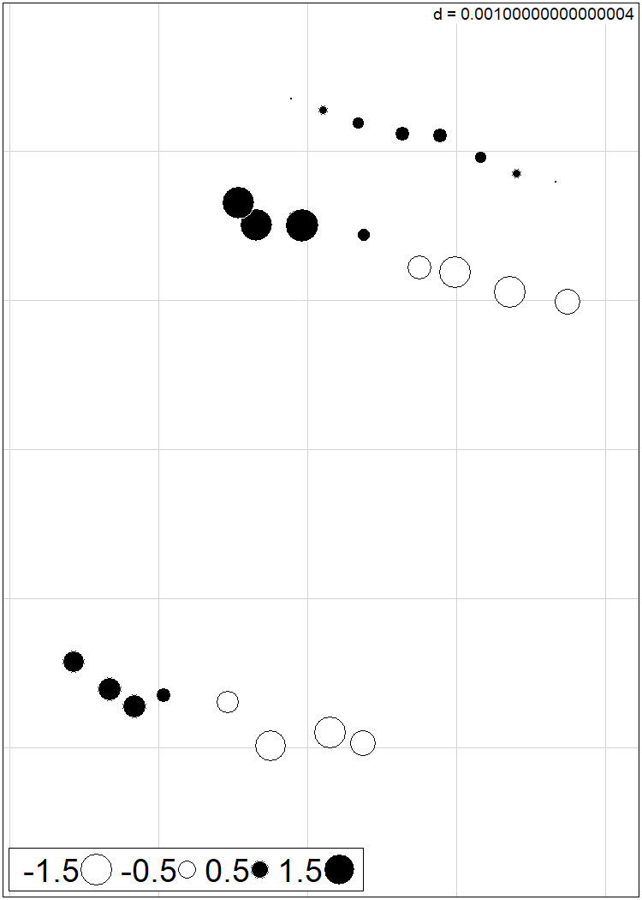

Spatial Autocorrelation Analysis
================
Rodolfo Pelinson
14/10/2020

The goal of pelinson.et.al.2020 is to walk the user through the
statistical analysis presented in “Pelinson et al 2020. Top predator
introduction changes the effects of spatial isolation on freshwater
community structure”

You can install the last version of `pelinson.et.al.2020` package from
my [GitHub](https://github.com/RodolfoPelinson/pelinson.et.al.2020)
with:

``` r
install.packages("devtools")
devtools::install_github("RodolfoPelinson/pelinson.et.al.2020")
library("pelinson.et.al.2020")
```

This will give you access to all the data and functions used to produce
the results shown in “Pelinson et al 2020. Top predator introduction
changes the effects of spatial isolation on freshwater community
structure”.

Other packages used here are:  
`lme4` version 1.1-23  
`emmeans` version 1.4.8

``` r
library(adegraphics)
library(adespatial)
library(ade4)
```

## Spatial Autocorrelation Analisis

``` r
data(coord)
```

First we have to define a threshold distance to truncate the distance
matrix. We chose 60m as threshold. Thus I measured the distance between
ponds A1 and A2, which was 28 meters, to find how much 60 meters mean in
our xy coordinate matrix.

``` r
DistA1_A2_meters <- 28
DistA1_A2_decimals <- dist(coord)[1]
dist_60m <- (60*DistA1_A2_decimals)/28
dist_60m
```

    ## [1] 0.0005808447

Now we create the distance based Moran Eigenvector Maps (dbMEMs):

``` r
dbMEM_exp1 <- dbmem(dist(coord), silent = F, thresh = dist_60m)
```

    ## User-provided truncation threshold = 0.0005808447 
    ## Time to compute dbMEMs = 0.010000  sec

``` r
rownames(dbMEM_exp1) <- rownames(coord)
```

We can plot our ponds and see wich ones were considered conected with a
60 meter truncation distance:

``` r
adegraphics::s.label(coord, nb = attr(dbMEM_exp1, "listw"), xax = 2, yax = 1, plabels = list(cex = 1, boxes = list(col = "grey90")), 
                     ylim = c(-22.8092,-22.8045), xlim = c(-49.1908, -49.1870))
```

<!-- -->

We endded up with 4 MEMs. We can plot then to see what patterns each one
account for:

MEM1

``` r
sr_value(coord, dbMEM_exp1[,1], ylim = c(-22.81,-22.804), xlim = c(-49.19057, -49.18725), grid=T, csize = 0.8, clegend = 1.5, xax = 2, yax = 1, method = "bubble")
```

<!-- -->

MEM2

``` r
sr_value(coord, dbMEM_exp1[,2], ylim = c(-22.81,-22.804), xlim = c(-49.19057, -49.18725), grid=T, csize = 0.8, clegend = 1.5, xax = 2, yax = 1, method = "bubble")
```

<!-- -->

MEM3

``` r
sr_value(coord, dbMEM_exp1[,3], ylim = c(-22.81,-22.804), xlim = c(-49.19057, -49.18725), grid=T, csize = 0.8, clegend = 1.5, xax = 2, yax = 1, method = "bubble")
```

<!-- -->

MEM4

``` r
sr_value(coord, dbMEM_exp1[,4], ylim = c(-22.81,-22.804), xlim = c(-49.19057, -49.18725), grid=T, csize = 0.8, clegend = 1.5, xax = 2, yax = 1, method = "bubble")
```

<!-- -->

Before analyzing the data, we remove the ponds for wich we do not have
community data:

``` r
dbMEM_exp1 <- dbMEM_exp1[which(rownames(coord) != "A4" & rownames(coord) != "B3" & rownames(coord) != "C3" & rownames(coord) != "C4"),]
```
